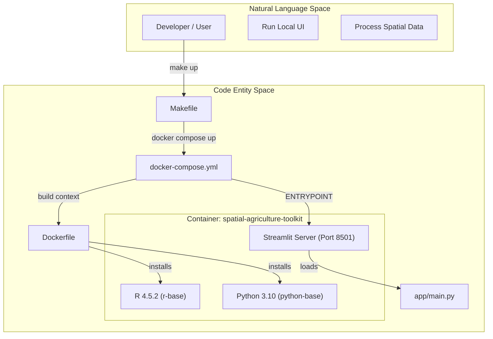
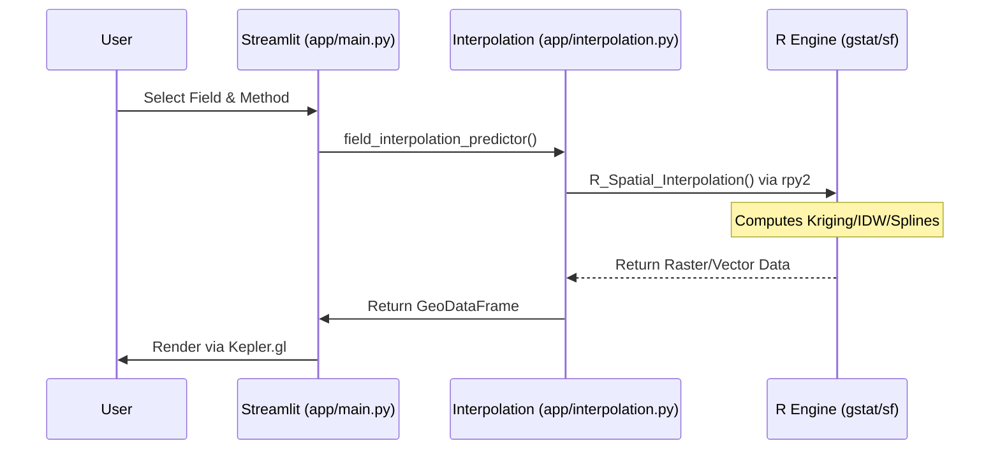

# Getting Started

This page provides a comprehensive technical guide for setting up the **Spatial Agriculture Toolkit** development environment. The toolkit is a hybrid platform combining Python-based Streamlit interfaces with high-performance R spatial statistics engines.

## Purpose and Scope

The goal of this guide is to enable a developer to move from a fresh repository clone to a fully functional local environment. Due to the complex nature of spatial dependencies (GDAL, PROJ, GEOS) and the requirement for a dual-language runtime (Python 3.10 and R 4.5.2), the project utilizes a multi-stage Docker architecture to ensure environment parity across development and production.

---

## Environment Prerequisites

The toolkit requires specific versions of system libraries to handle geospatial operations.

| Component | Version | Role |
| :--- | :--- | :--- |
| **Python** | 3.10.18 | Application logic, UI (Streamlit), and Data Processing |
| **R** | 4.5.2 | Spatial Interpolation (gstat) and Raster processing |
| **Docker** | 20.10+ | Containerization and environment isolation |
| **GDAL** | 3.0.4 (Focal) | Geospatial Data Abstraction Library |

**Sources:**
- `Dockerfile:3-109` (Specifies Python 3.10.18 and Ubuntu 20.04 Focal base)
- `Dockerfile:8-21` (Specifies R base installation)

---

## Local Setup and Installation

The recommended way to run the application is via Docker to avoid local dependency conflicts with spatial libraries like `libgdal` or `libproj`.

### 1. Repository Initialization
Clone the repository and ensure the directory structure for persistent data exists.
```bash
git clone https://github.com/Data-Crew/spatial-agriculture-toolkit
cd spatial-agriculture-toolkit
mkdir -p data output
```

### 2. Using the Makefile
The project includes a `Makefile` to abstract complex Docker commands into simple lifecycle targets.

*   **Build the environment:** `make build` executes the multi-stage build defined in the `Dockerfile` `Makefile:4-5`.
*   **Launch the application:** `make up` starts the Streamlit server on port `8501` `Makefile:8-9`.
*   **Clean the environment:** `make clean` removes containers and volumes to reset the state `Makefile:32-34`.

### 3. Service Definition
The `docker-compose.yml` maps local directories to the container to allow for real-time code updates and persistent output storage.

| Host Path | Container Path | Purpose |
| :--- | :--- | :--- |
| `./app` | `/app/app` | Streamlit source code and assets |
| `./data` | `/app/data` | Input shapefiles, CSVs, and GeoJSONs |
| `./output` | `/app/output` | Generated GeoTIFFs and analysis results |
| `./scripts` | `/app/scripts` | CLI tools for tile fragmentation |

**Sources:**
- `Makefile:1-41`
- `docker-compose.yml:9-13`

---

## System Architecture & Data Flow

The following diagram illustrates how the system transitions from "Natural Language Space" (User Requirements) to "Code Entity Space" (Implementation) during the startup and execution phase.

### System Startup and Component Mapping

**Sources:**
- `Makefile:8-9`
- `docker-compose.yml:1-8`
- `Dockerfile:6-80`

---

## Project Directory Layout

The repository is organized to separate the UI logic from the data processing scripts and the spatial outputs.

```text
.
├── app/                # Streamlit Application Source
│   ├── main.py         # Entry point for the UI
│   ├── interpolation.py # Python-R Bridge for Interpolation
│   ├── moran.py        # Spatial Autocorrelation Logic
│   └── geo_utils.py    # Geospatial H3 and Weight Utilities
├── data/               # Input Datasets (Git ignored except .gitkeep)
├── output/             # Generated Assets (TIF, GeoJSON)
├── scripts/            # Utility Scripts
│   └── fragment_tile.py # CLI for data fragmentation
├── Dockerfile          # Multi-stage build (R + Python)
├── docker-compose.yml  # Service orchestration
└── Makefile            # Developer lifecycle commands
```

### Data Flow Implementation
The application logic follows a strict path from data ingestion to spatial visualization.



**Sources:**
- `docker-compose.yml:10-13` (Volume mappings)
- `.gitignore:45-53` (Data/Output exclusion rules)
- `app/main.py:1-50` (General application structure)

---

## Configuration and Persistence

### Docker Multi-Stage Build
The `Dockerfile` is split into two primary stages to optimize build time and ensure all R dependencies are satisfied before the Python environment is layered on top:
1.  **`r-base` Stage**: Installs system-level spatial libraries (`libgdal-dev`, `libproj-dev`) and R packages like `sf`, `terra`, and `gstat` `Dockerfile:6-78`.
2.  **`python-base` Stage**: Installs Python 3.10 and the `rpy2` bridge to allow Python to call the R functions defined in the previous stage `Dockerfile:80-161`.

### Ignored Files
The environment is configured to prevent large spatial datasets from entering version control. `data/*` and `output/*` are excluded in both `.gitignore` and `.dockerignore` to keep the image size small and the repository clean.

**Sources:**
- `Dockerfile:1-161`
- `.gitignore:45-52`
- `.dockerignore:24-31`

---
