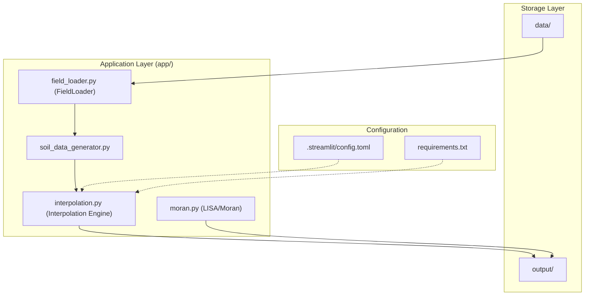

# Project Structure & Configuration

This page details the organizational layout of the `spatial-agriculture-toolkit` repository. It covers the directory hierarchy, the configuration of the Streamlit execution environment, and the comprehensive dependency manifest required to support the hybrid Python/R spatial analysis engine.

## Repository Layout

The project is structured to separate application logic, data persistence, and auxiliary scripts. The core logic resides within the `app/` directory, while `data/` and `output/` serve as the primary I/O interfaces for spatial datasets and generated artifacts.

### Directory Hierarchy

| Directory | Purpose |
| :--- | :--- |
| `.streamlit/` | Contains configuration for the Streamlit web server ` .streamlit/config.toml:1-3`. |
| `app/` | The primary Python package containing UI logic, interpolation engines, and geospatial utilities ` app/__init__.py:1-3`. |
| `data/` | Placeholder for input datasets (e.g., GeoJSON, CSV properties) used by the `FieldLoader` ` data/.gitkeep:1-1`. |
| `output/` | Destination for generated GeoTIFFs, realization CSVs, and Kepler.gl exports ` output/.gitkeep:1-1`. |
| `scripts/` | Contains CLI utilities for data preprocessing, such as tile fragmentation. |

### Data Flow and Component Interaction

The following diagram illustrates how the directory structure maps to the system's data flow, from raw input to spatial analysis.

**System Data Flow and Component Mapping**

Sources: `app/__init__.py:1-3`, `data/.gitkeep:1-1`, `output/.gitkeep:1-1`, `.streamlit/config.toml:1-3`

---

## Configuration Files

### Streamlit Configuration
The `.streamlit/config.toml` file manages the behavior of the web server. Currently, it is configured to handle large geospatial payloads by increasing the message size limit.

*   **`server.maxMessageSize`**: Set to `500` MB to allow the transfer of high-resolution GeoJSON and Kepler.gl configuration objects between the backend and the browser ` .streamlit/config.toml:1-2`.

### Python Dependency Manifest
The `requirements.txt` file specifies a strict versioning policy to ensure compatibility between the complex geospatial libraries and the `rpy2` bridge.

**Key Dependency Groups:**
*   **Geospatial Stack**: `geopandas`, `rasterio`, `fiona`, `shapely`, and `pyproj` provide the foundation for vector and raster operations ` requirements.txt:11-17`.
*   **Spatial Analysis (PySAL)**: A comprehensive suite including `libpysal`, `esda` (for Moran's I), and `spreg` ` requirements.txt:24-35`.
*   **R Integration**: `rpy2` (v3.5.13) is used to invoke R-based kriging and spline interpolation ` requirements.txt:44-44`.
*   **Visualization**: `keplergl` and `streamlit-keplergl` handle the high-performance 3D spatial rendering ` requirements.txt:50-55`.
*   **H3 Indexing**: `h3` and `h3pandas` are used for hexagonal hierarchical spatial indexing ` requirements.txt:22-23`.

Sources: `.streamlit/config.toml:1-3`, `requirements.txt:1-60`

---

## Implementation Details: Code-to-Structure Mapping

The project structure is designed to support a modular workflow where data is ingested, synthesized, and analyzed through distinct Python modules.

**Code Entity to File System Mapping**
```mermaid
classDiagram
    class StreamlitApp {
        <<Entry Point>>
        main.py
        config.toml
    }
    class SpatialEngine {
        interpolation.py
        moran.py
        geo_utils.py
    }
    class DataManagement {
        field_loader.py
        soil_data_generator.py
        tile_fragmenter.py
    }

    StreamlitApp --> SpatialEngine : invokes
    SpatialEngine --> DataManagement : requests data
    DataManagement ..> "data/" : reads
    SpatialEngine ..> "output/" : writes
```

### Module Responsibilities

1.  **`app/`**: This is the root package. It includes the `__init__.py` which defines the toolkit version as `0.1.0` ` app/__init__.py:3-3`.
2.  **`requirements.txt`**: This file acts as the environment blueprint. It includes specialized libraries like `PuLP` for optimization ` requirements.txt:72-72` and `mgwr` for Multi-Scale Geographically Weighted Regression ` requirements.txt:41-41`.
3.  **`data/` and `output/`**: These directories are maintained in the repository via `.gitkeep` files to ensure the application has valid I/O paths immediately upon cloning ` data/.gitkeep:1-1`, ` output/.gitkeep:1-1`.

Sources: `app/__init__.py:1-4`, `requirements.txt:1-295`, `data/.gitkeep:1-1`, `output/.gitkeep:1-1`

---
