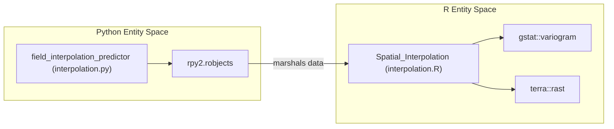

# Application Architecture

The Spatial Agriculture Toolkit is a hybrid geospatial analysis platform that combines a **Streamlit** web interface with a high-performance execution engine utilizing both **Python** and **R**. The architecture is designed to handle complex spatial operations—such as Kriging interpolation and Local Indicators of Spatial Association (LISA)—while providing a responsive, interactive visualization layer via **Kepler.gl**.

## System Overview

The application follows a modular design where the frontend (Streamlit) manages state and user input, while specialized modules handle data synthesis, interpolation, and autocorrelation. A key architectural feature is the **hybrid execution model**: Python manages the application lifecycle and data orchestration, while R is invoked for statistically rigorous spatial modeling that lacks mature Python equivalents (e.g., specific Kriging implementations in `gstat`).

### Core Component Interaction
The diagram below illustrates how the major code entities interact across the Python/R boundary and the data flow from synthesis to visualization.

**Toolkit Component Interaction**
```mermaid
graph TD
    subgraph "Frontend (Streamlit)"
        [app/main.py] --> ["FieldLoader (field_loader.py)"]
        [app/main.py] --> ["KeplerGl (keplergl_static)"]
    end

    subgraph "Analysis Modules (Python)"
        ["field_interpolation_predictor"] -- "rpy2 bridge" --> ["R Engine"]
        ["add_local_autocorrelation_labels"] --> ["geopandas_to_h3"]
        ["soil_data_generator.py"] --> ["FieldLoader"]
    end

    subgraph "Statistical Engine (R)"
        ["R Engine"] --> ["gstat::krige"]
        ["R Engine"] --> ["terra::rasterize"]
    end

    ["FieldLoader"] -- "Loads" --> ["GeoJSON/CSV Data"]
    ["GeoJSON/CSV Data"] -- "Feeds" --> ["field_interpolation_predictor"]
    ["GeoJSON/CSV Data"] -- "Feeds" --> ["add_local_autocorrelation_labels"]
    ["field_interpolation_predictor"] -- "Output" --> ["KeplerGl"]
    ["add_local_autocorrelation_labels"] -- "Output" --> ["KeplerGl"]
```
**Sources:** `app/main.py:26-35`, `app/main.py:69-73`, `app/spatial_interpolations/interpolation.py:1-50`

---

## Hybrid Execution Model

The toolkit leverages `rpy2` to bridge the Python and R environments. This allows the application to utilize R's specialized spatial libraries like `sf`, `terra`, and `gstat` directly within a Pythonic workflow.

*   **Python Layer:** Handles UI components, H3 hexagonal indexing `app/spatial_autocorrelation/geo_utils.py:10-15`, and data manipulation via `geopandas`.
*   **R Layer:** Performs heavy-duty spatial interpolation. The `field_interpolation_predictor` `app/spatial_interpolations/interpolation.py:26` prepares data for the R function `Spatial_Interpolation`, which executes methods like Ordinary Kriging or Generalized Additive Models (GAM).

**Entity Mapping: Python to R Bridge**

**Sources:** `app/spatial_interpolations/interpolation.py:26-40`, `Dockerfile:48-78`

---

## Key Subsystems

### 1. Main Application Entry Point
The `app/main.py` file serves as the central orchestrator. It manages the **Streamlit Session State** to persist loaded field data `app/main.py:146-150` and provides the sidebar navigation for switching between "Spatial Interpolations" and "Spatial Autocorrelation" modes `app/main.py:69-73`.

For details, see [Main Application Entry Point (app/main.py)](03.1-streamlit-frontend.md).

### 2. Data Synthesis & Loading
The toolkit includes a robust data layer capable of generating synthetic soil realizations. The `FieldLoader` class `app/data_synthesis/field_loader.py:27` handles the discovery and streaming of GeoJSON tiles, ensuring memory efficiency by using spatial indexing and bounding box filters `app/main.py:124-130`.

For details, see [Data Synthesis Module](06-data-synthesis.md).

### 3. Containerization
Due to the complexity of maintaining both R 4.5.2 and Python 3.10.18 environments with specific spatial C-libraries (GDAL, PROJ, GEOS), the application is deployed via a multi-stage Docker configuration `Dockerfile:1-6`. This ensures parity between development and production environments.

For details, see [Containerization & Deployment](03.2-python-r-integration.md).

---

## Module Interaction Summary

| Module | Primary Responsibility | Key Code Entities |
| :--- | :--- | :--- |
| **UI/Orchestration** | Navigation, State, Mapping | `app/main.py`, `KeplerGl` |
| **Interpolation** | Probability surfaces, Kriging | `field_interpolation_predictor`, `interpolation.R` |
| **Autocorrelation** | LISA clusters, Moran's I | `lisa`, `geopandas_to_h3`, `compute_weights` |
| **Data Management** | Tile loading, Synthesis | `FieldLoader`, `soil_data_generator.py` |

**Sources:** `app/main.py:1-40`, `app/spatial_interpolations/interpolation.py:1-30`, `app/spatial_autocorrelation/moran.py:1-20`

---
