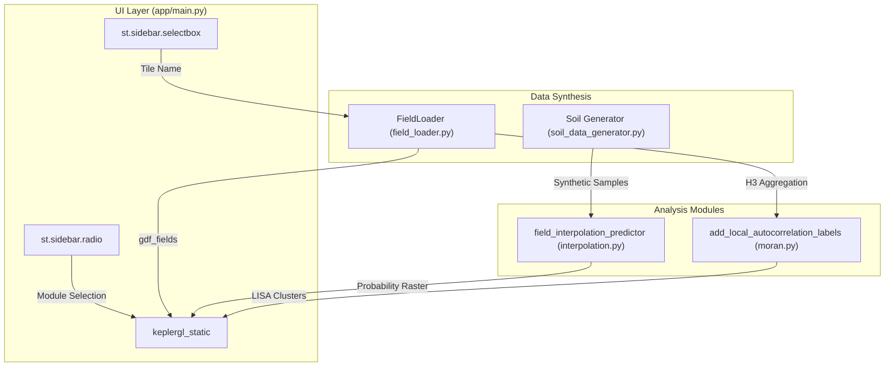
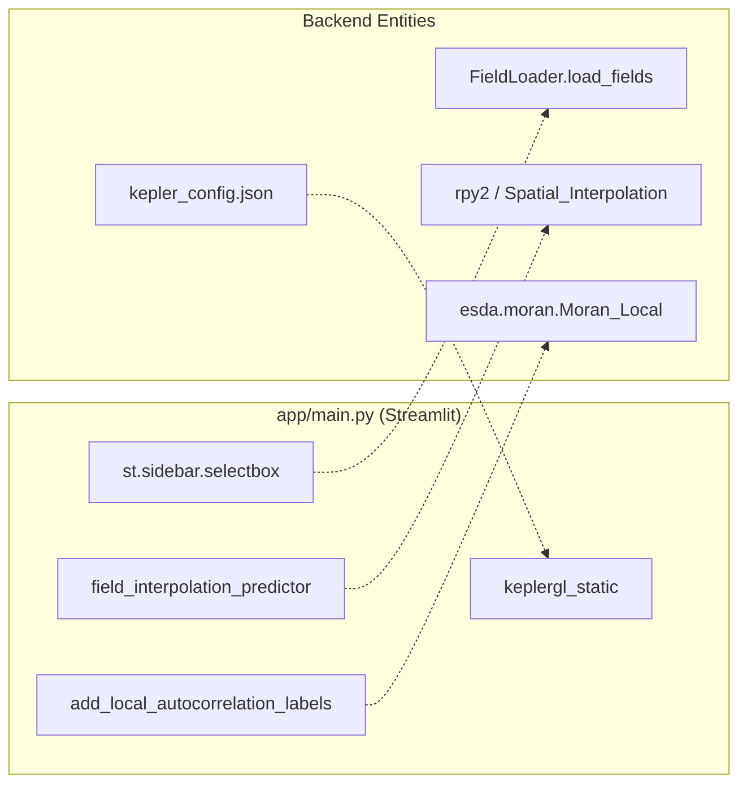

# Main Application Entry Point (app/main.py)

The `app/main.py` file serves as the central orchestration layer for the Spatial Agriculture Toolkit. It defines the Streamlit user interface, manages the application lifecycle through session state, and coordinates data flow between the synthetic data generation, spatial interpolation, and autocorrelation modules.

## Application Lifecycle and Configuration

The application initializes with a wide layout and a persistent sidebar for navigation. It utilizes custom CSS to provide branding and visual structure.

*   **Page Config**: Sets the title "Spatial Agriculture Toolkit", the icon "🌾", and forces an expanded sidebar state `app/main.py:38-43`.
*   **Branding**: Injects custom CSS classes (`.main-header`, `.subtitle`) to standardize the look and feel `app/main.py:46-66`.
*   **Navigation**: Uses `st.sidebar.radio` to switch between the two primary analysis modules: "Spatial Interpolations" and "Spatial Autocorrelation" `app/main.py:69-73`.

### Session State Management
The application relies on `st.session_state` to maintain data persistence across re-runs, specifically for loaded field geometries and analysis results.

| State Key | Purpose |
| :--- | :--- |
| `loaded_fields` | Stores the GeoDataFrame of field boundaries for the currently selected tile `app/main.py:146-170`. |
| `selected_tile` | Tracks the active GeoJSON tile name to detect when a user switches datasets `app/main.py:146-170`. |
| `tile_center` | Stores the calculated centroid of the selected tile for map centering `app/main.py:148-170`. |
| `analysis_results` | Holds the output from interpolation or autocorrelation runs to prevent re-computation on UI interactions. |

### Caching Strategy
The toolkit employs multiple caching decorators to optimize performance and resource usage:
1.  **`@st.cache_resource`**: Used for `get_field_loader()` to ensure only one instance of the `FieldLoader` class exists `app/main.py:87-89`.
2.  **`@st.cache_data`**: Used for data-heavy operations with specific Time-To-Live (TTL) settings:
    *   `get_available_tiles()`: 5-minute TTL to refresh the file system view `app/main.py:97-99`.
    *   `get_cached_tile_bounds()`: 1-hour TTL for spatial boundary calculations `app/main.py:123-125`.

**Sources:** `app/main.py:37-185`

---

## Data Flow Architecture

The application acts as a bridge between the user's spatial selection and the underlying analytical engines.

### System Data Flow Diagram
The following diagram illustrates how `app/main.py` coordinates data between the UI, the `FieldLoader`, and the analysis modules.

"Data Flow from UI to Analysis Engines"

**Sources:** `app/main.py:26-35`, `app/main.py:69-170`

---

## Spatial Interpolation Workflow

When the "Spatial Interpolations" module is active, the entry point facilitates a multi-step process for generating and visualizing field data.

1.  **Tile Selection**: The user selects a GeoJSON tile. `main.py` calls `field_loader.list_available_tiles()` `app/main.py:98-115`.
2.  **Field Loading**: The `FieldLoader` retrieves geometries. A `max_fields` constraint is provided via `st.sidebar.number_input` to prevent Out-Of-Memory (OOM) errors `app/main.py:136-156`.
3.  **Sample Generation**: The UI triggers `generate_soil_samples_in_region` to create synthetic observations within the selected field boundaries `app/main.py:28-29`.
4.  **Prediction**: The data is passed to `field_interpolation_predictor` `app/main.py:26`, which invokes the R-based interpolation engine.
5.  **Visualization**: The resulting GeoDataFrames are passed to a `KeplerGl` object.

**Sources:** `app/main.py:78-185`

---

## Spatial Autocorrelation Workflow

The "Spatial Autocorrelation" module focuses on identifying clusters of high and low values (LISA analysis).

1.  **Grid Aggregation**: Geometries are converted to H3 hexagonal grids using `geopandas_to_h3` `app/main.py:35`.
2.  **Statistical Analysis**: The application calls `add_local_autocorrelation_labels` `app/main.py:35` to compute Moran's I and categorize cells into HH (High-High), LL (Low-Low), etc.
3.  **Thematic Mapping**: The results are styled according to the cluster classifications and rendered in the Kepler.gl component.

**Sources:** `app/main.py:35-36`

---

## Kepler.gl Integration

The application uses `keplergl` for high-performance geospatial rendering. The integration involves:

*   **Instance Creation**: `KeplerGl(data=data_dict, config=config_dict)` is used to instantiate the map.
*   **Static Rendering**: Because Streamlit is reactive, the app uses `keplergl_static` `app/main.py:10` to render the map component. This ensures the map state is consistent with the Streamlit session but requires a full re-render when data changes.
*   **Configuration Injection**: The application loads module-specific JSON configurations (e.g., `kepler_config.json`) to define layers, filters, and color palettes automatically.

### Code Entity Association
This diagram maps UI components in `app/main.py` to their corresponding backend logic and configuration files.

"UI to Backend Mapping"

**Sources:** `app/main.py:8-10`, `app/main.py:26-35`, `app/main.py:88-156`

---
