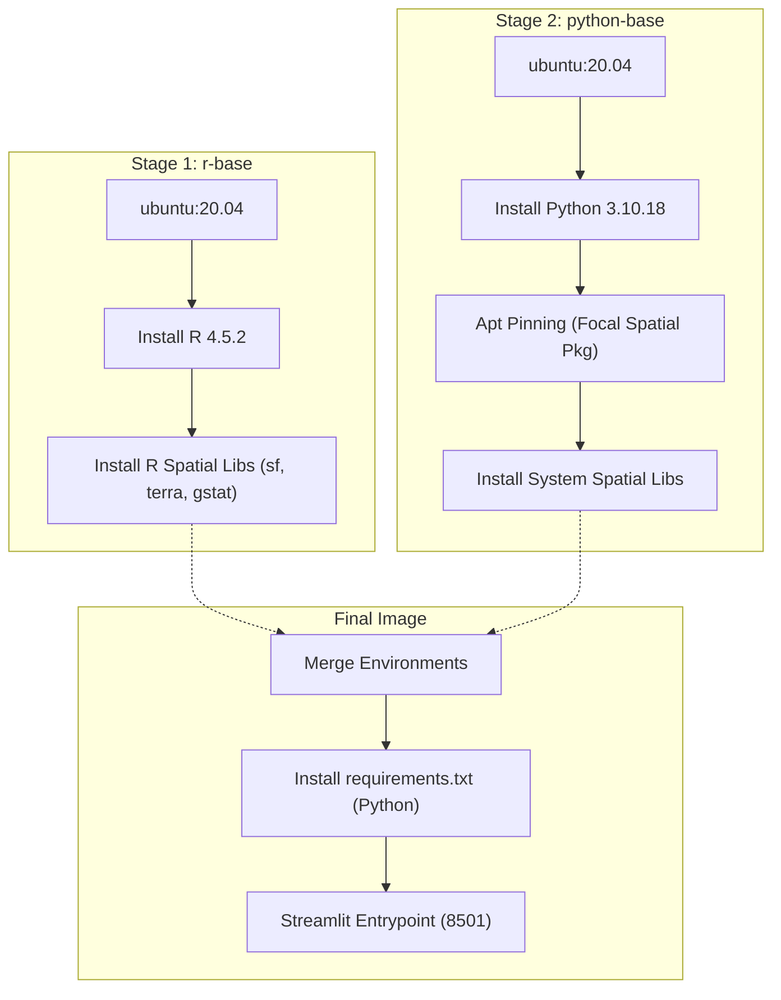
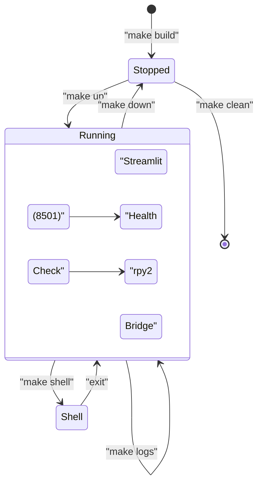

# Containerization & Deployment

This page details the containerization strategy for the Spatial Agriculture Toolkit. The application utilizes a sophisticated multi-stage Docker build to harmonize a Python 3.10 environment with a specific R 4.5.2 geospatial stack, ensuring consistent execution of the `rpy2` bridge across different deployment environments.

## Multi-Stage Docker Build

The build process is divided into distinct stages to manage the complex dependency requirements of both Python and R geospatial libraries. It replicates an Ubuntu 20.04 (Focal) environment to ensure binary compatibility for libraries like `GDAL`, `PROJ`, and `GEOS`.

### 1. R-Base Stage (`r-base`)
This stage focuses on establishing the R runtime and installing the heavy geospatial R packages.
- **Base Image**: `ubuntu:20.04` `Dockerfile:6-6`.
- **System Dependencies**: Installs `r-base`, `r-base-dev`, and essential spatial system libraries including `libgdal-dev`, `libproj-dev`, and `libgeos-dev` `Dockerfile:11-46`.
- **R Packages**: Installs a specific suite of R packages required for spatial interpolation, including `sf`, `terra`, `raster`, and `gstat` `Dockerfile:50-77`.

### 2. Python-Base Stage (`python-base`)
This stage prepares the Python 3.10 environment while maintaining the R spatial dependencies.
- **Python Setup**: Installs `python3.10` from the `ppa:savoury1/python` repository `Dockerfile:95-107`.
- **Apt Pinning**: Implements strict `apt` preferences to prioritize Ubuntu Focal packages for spatial libraries (e.g., `libgdal26`), preventing version conflicts during the Python library installation `Dockerfile:96-100`.
- **Spatial Libraries**: Re-installs necessary system-level spatial dependencies to ensure the Python environment can link against the same shared objects as the R environment `Dockerfile:141-158`.

### 3. Final Stage
The final stage assembles the application, copies the R library paths, and installs Python requirements.
- **Environment Variables**: Sets `PYTHONUNBUFFERED=1` to ensure real-time log output `Dockerfile:14-15`.
- **Health Check**: Implements a check that verifies the availability of the `streamlit` module to determine container health `docker-compose.yml:17-22`.

### Build Pipeline Diagram

The following diagram illustrates the flow from base OS to the final application container.

**Docker Build Flow**

**Sources:** `Dockerfile:1-161`, `docker-compose.yml:1-23`

---

## Service Definition & Configuration

The application is orchestrated using `docker-compose.yml`, which defines the runtime environment, volume mappings, and networking.

### Docker Compose Configuration
The `app` service is the primary container for the toolkit.

| Parameter | Value | Description |
| :--- | :--- | :--- |
| **Build Context** | `.` | Root directory of the project `docker-compose.yml:4-4`. |
| **Ports** | `8501:8501` | Maps the Streamlit default port `docker-compose.yml:8-8`. |
| **Restart Policy** | `unless-stopped` | Ensures service persistence `docker-compose.yml:16-16`. |
| **Health Check** | `python -c "import streamlit"` | Validates environment readiness `docker-compose.yml:18-18`. |

### Volume Mapping
To facilitate development and data persistence, local directories are mounted into the container at `/app/`:
- `./app`: Application source code `docker-compose.yml:10-10`.
- `./data`: Input datasets (GeoJSON, CSV) `docker-compose.yml:11-11`.
- `./output`: Generated GeoTIFFs and analysis results `docker-compose.yml:12-12`.
- `./scripts`: Utility scripts for fragmentation and data management `docker-compose.yml:13-13`.

### Build Exclusions
The `.dockerignore` file prevents unnecessary files from bloating the build context, specifically excluding:
- Large datasets in `data/` and `output/` (except `.gitkeep` files) `.dockerignore:24-31`.
- Python artifacts like `__pycache__` and `.venv` `.dockerignore:6-21`.
- Local environment files and IDE settings `.dockerignore:18-41`.

**Sources:** `docker-compose.yml:1-23`, `.dockerignore:1-50`

---

## Lifecycle Management (Makefile)

A `Makefile` is provided to abstract complex Docker commands into simple targets for developers.

### Core Targets

| Target | Command | Purpose |
| :--- | :--- | :--- |
| `build` | `docker compose build` | Builds the image using the multi-stage Dockerfile `Makefile:4-5`. |
| `up` | `docker compose up` | Starts the container in the foreground `Makefile:8-9`. |
| `up-d` | `docker compose up -d` | Starts the container in detached mode `Makefile:12-13`. |
| `down` | `docker compose down` | Stops and removes containers `Makefile:16-17`. |
| `shell` | `docker compose exec -it app bash` | Opens an interactive terminal in the running container `Makefile:24-25`. |
| `rebuild` | `docker compose down -v && ... --no-cache` | Performs a clean rebuild of the entire stack `Makefile:37-40`. |

### Deployment Lifecycle Diagram

This diagram maps the `Makefile` targets to the underlying Docker actions and container states.

**System Lifecycle and Makefile Mapping**

**Sources:** `Makefile:1-41`, `docker-compose.yml:17-22`

---

## Environment Wiring

The integration between the host and the container is strictly defined to ensure the Python-R bridge (`rpy2`) functions correctly.

### Pathing and Dependencies
1. **R Library Path**: The Dockerfile ensures R packages are installed in the global library path so that `rpy2` can locate them without additional environment variables `Dockerfile:50-78`.
2. **Python Path**: `PYTHONUNBUFFERED=1` is passed via `docker-compose` to ensure that Streamlit logs and R console output (captured via the bridge) are visible in the `make logs` output `docker-compose.yml:15-15`.
3. **Working Directory**: The container sets `/app` as the working directory, which matches the relative pathing used in the `FieldLoader` and `Spatial_Interpolation` R functions.

**Sources:** `Dockerfile:50-78`, `docker-compose.yml:14-15`, `Makefile:19-21`

---
