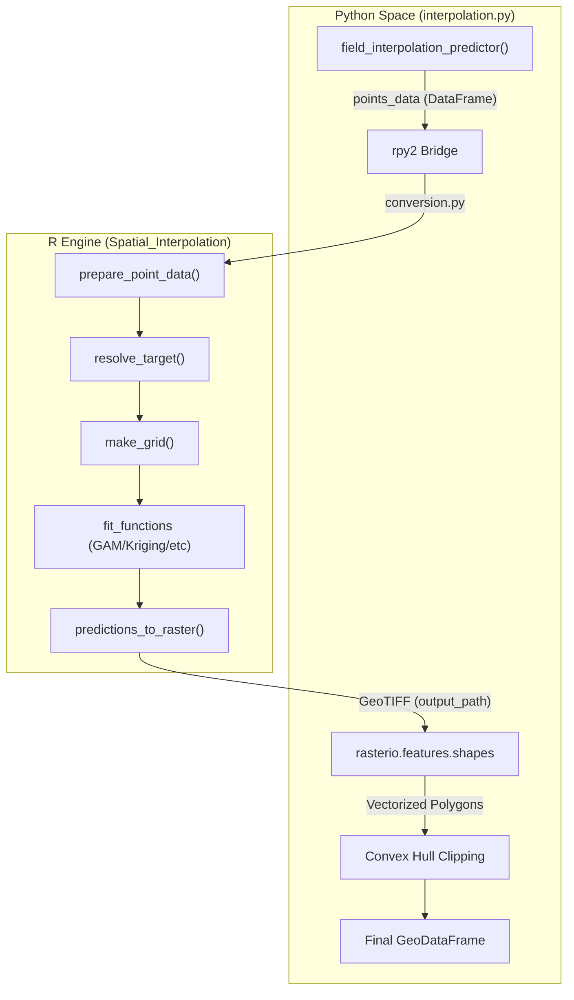
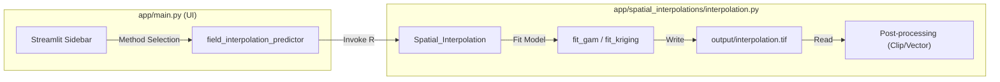

# Spatial Interpolation Module

The **Spatial Interpolation Module** is a hybrid Python/R subsystem designed to predict the occurrence probabilities of agricultural events or soil properties across a continuous field surface based on discrete point samples. It leverages the statistical power of R for spatial modeling and Python for geospatial data orchestration and UI integration.

### Purpose and Scope
The module transforms raw point data (e.g., soil samples, pest sightings) into a probability surface. It supports five distinct mathematical models to account for different spatial patterns and data densities. The output is a vectorized representation of a probability raster, clipped to the field's convex hull, and styled for visualization in Kepler.gl.

For details on the underlying mathematical models and R-to-Python bridge, see [Interpolation Engine (interpolation.py)](04.1-interpolation-engine.md).
For details on how the resulting surfaces are rendered, see [Interpolation Visualization (Kepler.gl Config)](04.2-interpolation-visualization.md).

### System Architecture
The module follows a three-stage pipeline:
1.  **Data Preparation (Python):** Cleans input `GeoDataFrame` objects and passes them to R via `rpy2`.
2.  **Statistical Modeling (R):** Executes the `Spatial_Interpolation` R function to fit models and generate a GeoTIFF.
3.  **Vectorization & Clipping (Python):** Converts the GeoTIFF back into a `GeoDataFrame`, applies a convex hull mask to prevent extrapolation artifacts, and prepares the data for the frontend.

#### Data Flow Diagram: Point to Probability Surface
The following diagram illustrates the transition from Python data structures to R modeling functions.

**Interpolation Pipeline Flow**

Sources: `app/spatial_interpolations/interpolation.py:44-45`, `app/spatial_interpolations/interpolation.py:175-195`, `app/spatial_interpolations/interpolation.py:214-230`

### Supported Interpolation Methods
The module provides a variety of methods to handle different agricultural scenarios, ranging from simple linear trends to complex non-linear spatial dependencies.

| Method | R Function | Description |
| :--- | :--- | :--- |
| **Linear** | `fit_linear` | Simple GLM using `lon + lat` as predictors. |
| **Orthogonal** | `fit_orthogonal` | Polynomial regression using `poly(lon, 3) * poly(lat, 3)`. |
| **Splines** | `fit_splines` | B-spline basis functions for flexible non-linear fitting. |
| **GAM** | `fit_gam` | Generalized Additive Models using Thin Plate Splines (`mgcv` package). |
| **Kriging** | `fit_kriging` | Ordinary Kriging with automated variogram fitting (`gstat` package). |

Sources: `app/spatial_interpolations/interpolation.py:103-156`, `app/spatial_interpolations/interpolation.py:184-191`

### Integration with Main Application
The interpolation module is exposed via the `field_interpolation_predictor` function in the `app.spatial_interpolations` package. It is typically invoked by the Streamlit UI when a user selects a specific realization or soil property to visualize.

**Code Entity Map: UI to Engine**

Sources: `app/spatial_interpolations/__init__.py:3-5`, `app/spatial_interpolations/interpolation.py:202-210`, `app/spatial_interpolations/interpolation.py:235-245`

### Key Components

#### The Python Interface
The function `field_interpolation_predictor` acts as the primary controller. It handles the initialization of the R environment via `rpy2.rinterface.initr()` and manages temporary file paths for the generated GeoTIFFs.
*   **Source:** `app/spatial_interpolations/interpolation.py:202-258`

#### The R Engine
Defined within the `R_INTERPOLATION_FUNCTION` string, this R script contains the logic for grid generation (`make_grid`), target resolution (`resolve_target`), and the actual statistical fitting. It ensures that predictions are clipped to the `[0, 1]` range, which is critical for probability interpretations.
*   **Source:** `app/spatial_interpolations/interpolation.py:47-198`

#### Post-Processing Logic
After R generates the raster, Python's `rasterio` and `geopandas` are used to convert pixel values into polygons. A `convex_hull` is computed from the original sample points and used to clip the resulting polygons, ensuring that the UI does not show predictions in areas where no data was collected.
*   **Source:** `app/spatial_interpolations/interpolation.py:246-258`

---
