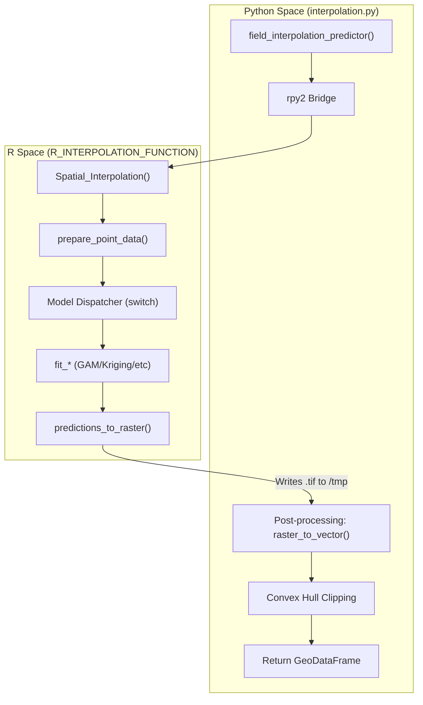
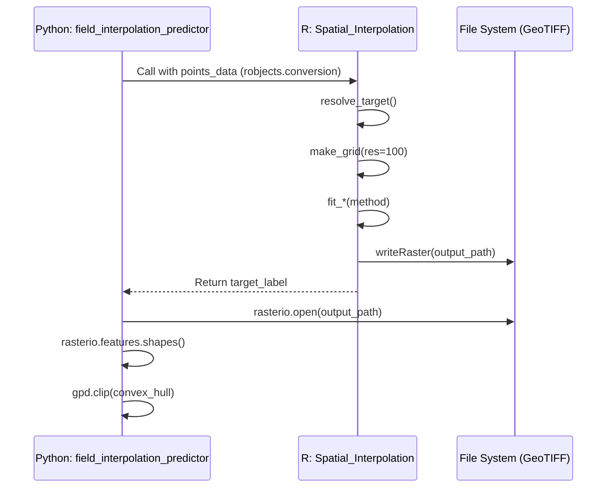

# Interpolation Engine (interpolation.py)

The Interpolation Engine is a hybrid Python/R subsystem designed to predict the spatial distribution of agricultural events or soil properties across field boundaries. It leverages `rpy2` to bridge high-level Python data structures (GeoPandas) with specialized R statistical libraries (`mgcv`, `gstat`, `splines`) to perform surface modeling.

## System Overview

The engine operates by taking a set of point observations (e.g., soil samples, pest sightings) and generating a continuous probability surface. This surface is then exported as a GeoTIFF and post-processed into vector polygons for visualization in the Streamlit UI.

### Data Flow and Bridge Architecture

The integration between Python and R is managed via `rpy2`. The Python side handles data loading and geometric clipping, while the R side performs the heavy statistical computation.

**Logical Data Flow:**
1.  **Python:** Receives `GeoDataFrame` and method selection.
2.  **R Bridge:** Converts pandas data to R `data.frame` using `pandas2ri` `app/spatial_interpolations/interpolation.py:15-16`.
3.  **R Engine:** Executes `Spatial_Interpolation` function `app/spatial_interpolations/interpolation.py:175-195`.
4.  **R Engine:** Fits model (GAM, Kriging, etc.) and generates a raster `app/spatial_interpolations/interpolation.py:183-193`.
5.  **Python:** Reads the generated GeoTIFF, vectorizes it, and clips it to the field's convex hull `app/spatial_interpolations/interpolation.py:240-264`.

### Entity Mapping: Natural Language to Code

| Concept | Code Entity | File |
| :--- | :--- | :--- |
| **Main Entry Point** | `field_interpolation_predictor` | `app/spatial_interpolations/interpolation.py:204` |
| **R Execution Hub** | `Spatial_Interpolation` (R function) | `app/spatial_interpolations/interpolation.py:175` |
| **Point Prep** | `prepare_point_data` | `app/spatial_interpolations/interpolation.py:58` |
| **Grid Generation** | `make_grid` | `app/spatial_interpolations/interpolation.py:92` |
| **Vectorization** | `rasterio.features.shapes` | `app/spatial_interpolations/interpolation.py:240` |

**Interpolation Process Bridge Diagram**

Sources: `app/spatial_interpolations/interpolation.py:47-195`, `app/spatial_interpolations/interpolation.py:204-270`

---

## Prediction Methods

The engine supports five distinct statistical methods for surface estimation, each implemented as a `fit_*` function in R.

| Method | R Function | Implementation Detail |
| :--- | :--- | :--- |
| **Linear** | `fit_linear` | GLM with `target ~ lon + lat` (binomial family) `app/spatial_interpolations/interpolation.py:103-106`. |
| **Orthogonal** | `fit_orthogonal` | GLM using `poly(lon, 3) * poly(lat, 3)` for non-linear trends `app/spatial_interpolations/interpolation.py:108-112`. |
| **Splines** | `fit_splines` | B-splines (`bs`) with degree 4 for flexible surface fitting `app/spatial_interpolations/interpolation.py:114-118`. |
| **GAM** | `fit_gam` | Generalized Additive Model using Thin Plate Splines (`bs="tp"`) `app/spatial_interpolations/interpolation.py:120-129`. |
| **Kriging** | `fit_kriging` | Ordinary Kriging with automated variogram fitting (Sph/Exp/Gau) `app/spatial_interpolations/interpolation.py:131-155`. |

### Method-Specific Logic
*   **GAM:** Dynamically calculates basis dimension `k` based on sample size: `min(max(20, floor(nrow(ppp) / 3)), 100)` `app/spatial_interpolations/interpolation.py:122`.
*   **Kriging:** Uses `gstat::fit.variogram` to find the best theoretical model and clips output to `[0, 1]` range to handle extrapolation artifacts `app/spatial_interpolations/interpolation.py:140-154`.

Sources: `app/spatial_interpolations/interpolation.py:103-156`

---

## Implementation Details

### R Environment Initialization
The module initializes the R runtime and ensures required base packages (`utils`, `stats`) are loaded into the R search path before executing any interpolation logic `app/spatial_interpolations/interpolation.py:10-26`.

### Raster-to-Vector Pipeline
After R generates the GeoTIFF at the specified `output_path`, the Python `field_interpolation_predictor` performs the following steps:

1.  **Loading:** Opens the GeoTIFF using `rasterio` `app/spatial_interpolations/interpolation.py:236`.
2.  **Vectorization:** Uses `rasterio.features.shapes` to extract polygons where pixel values represent probability `app/spatial_interpolations/interpolation.py:240-244`.
3.  **Clipping:** To prevent the interpolation from appearing as a perfect square, the engine calculates the **Convex Hull** of the original input points and clips the resulting polygons to this boundary `app/spatial_interpolations/interpolation.py:258-264`.

**Code Entity Interaction Diagram**

Sources: `app/spatial_interpolations/interpolation.py:159-171`, `app/spatial_interpolations/interpolation.py:230-265`

### Key Functions Reference

#### `field_interpolation_predictor`
*   **Purpose:** The primary Python interface.
*   **Arguments:** `points_df` (GeoDataFrame), `method` (str), `target_event` (Optional[str]).
*   **Returns:** A `GeoDataFrame` containing the interpolated polygons with a `probability` column.
*   **Source:** `app/spatial_interpolations/interpolation.py:204-270`

#### `predictions_to_raster` (R)
*   **Purpose:** Converts the flat prediction vector back into a spatial grid.
*   **Logic:** It maps the `expand.grid` results back to a matrix, flips the y-axis to align with standard North-up raster orientation, and writes a GeoTIFF `app/spatial_interpolations/interpolation.py:159-171`.

#### `resolve_target` (R)
*   **Purpose:** Validates the user-requested event type against the data.
*   **Logic:** If the requested event is missing or null, it defaults to the last available factor level in the dataset `app/spatial_interpolations/interpolation.py:72-88`.

Sources: `app/spatial_interpolations/interpolation.py:72-88`, `app/spatial_interpolations/interpolation.py:159-171`, `app/spatial_interpolations/interpolation.py:204-270`

---
