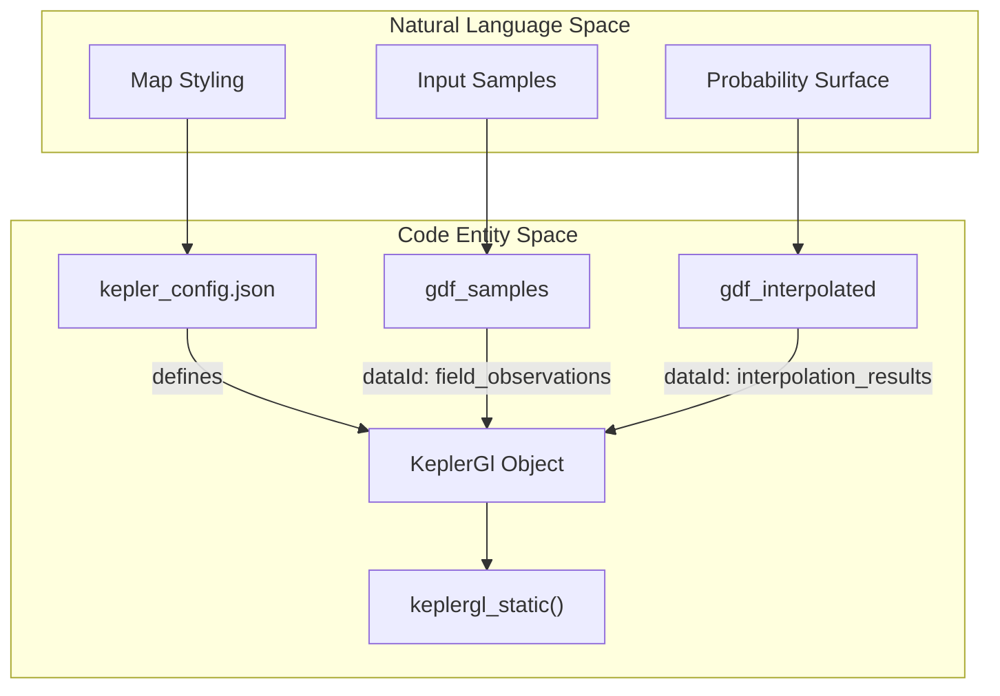
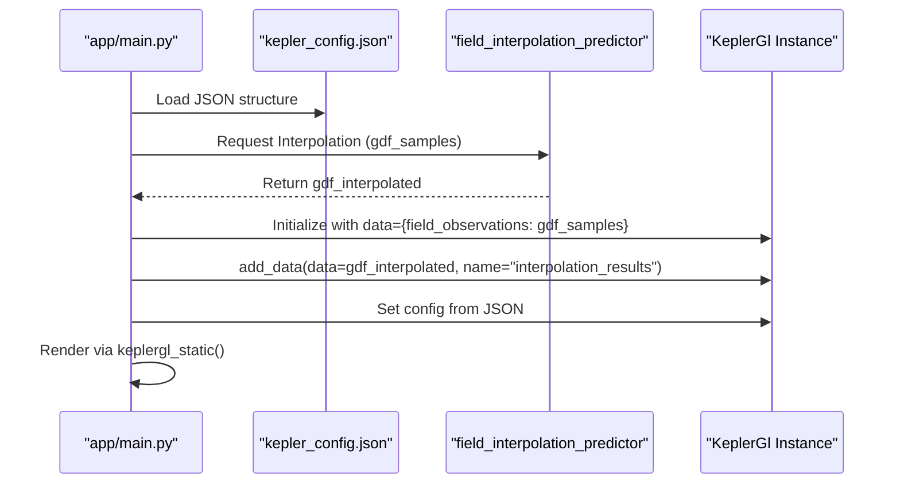

# Interpolation Visualization (Kepler.gl Config)

This page documents the visualization layer for the Spatial Interpolation module. It details the configuration of the Kepler.gl engine, specifically the `kepler_config.json` schema, the mapping of probability surfaces to color scales, and the runtime loading mechanism within the Streamlit application.

## Overview and Data Flow

The visualization system uses **Kepler.gl** to render the results of the spatial interpolation engine. The engine produces a GeoDataFrame containing a probability surface (vectorized from a raster grid), which is then injected into a pre-configured Kepler.gl map instance.

### System Architecture Diagram
The following diagram illustrates how the configuration file and data entities interact within the `app/main.py` execution context.

**Interpolation Visualization Pipeline**

**Sources:** `[app/main.py:26-35]`, `[app/spatial_interpolations/kepler_config.json:1-166]`

## Kepler.gl Configuration Schema

The file `app/spatial_interpolations/kepler_config.json` defines the visual state, interaction rules, and layer hierarchies for the interpolation output.

### 1. Layer Definitions
The configuration defines two primary data layers and one basemap layer.

| Layer ID | Type | Data Source (dataId) | Purpose |
| :--- | :--- | :--- | :--- |
| `basemap` | `basemap` | N/A | High-resolution satellite imagery from Stadia Maps ``app/spatial_interpolations/kepler_config.json:8-18``. |
| `field_observations` | `point` | `field_observations` | Displays the original ground-truth samples (e.g., soil test points) ``app/spatial_interpolations/kepler_config.json:20-70``. |
| `interpolation_results` | `polygon` | `interpolation_results` | Renders the predicted probability surface as a series of colored polygons ``app/spatial_interpolations/kepler_config.json:72-112``. |

### 2. Color Scales and Visual Channels
The probability surface uses a sequential color scale to represent intensity.

*   **Interpolation Scale:** Uses a "Probability Scale" ranging from blue (low probability) to orange/yellow (high probability) ``app/spatial_interpolations/kepler_config.json:86-91``.
*   **Color Mapping:** The `colorField` is mapped to the `probability` column in the data, using a `quantile` scale ``app/spatial_interpolations/kepler_config.json:101-105``.
*   **Point Styling:** Field observations are colored by `event_type` using an `ordinal` scale ``app/spatial_interpolations/kepler_config.json:60-64``.

### 3. Interaction Configuration
Tooltips are enabled to allow users to inspect specific values on the map.
*   **Observations:** Shows `event_type` and `plot_id` ``app/spatial_interpolations/kepler_config.json:117-117``.
*   **Interpolation:** Shows the numeric `probability` value ``app/spatial_interpolations/kepler_config.json:118-118``.

**Sources:** `[app/spatial_interpolations/kepler_config.json:20-132]`

## Runtime Implementation

The Streamlit application handles the lifecycle of the Kepler.gl instance, including loading the configuration from disk and binding the spatial data.

### Loading and Data Binding
The application loads the JSON configuration and initializes the `KeplerGl` object. It then adds the datasets produced by the `field_interpolation_predictor`.

**Kepler.gl Initialization Sequence**

### Key Functions and Variables
*   **`kepler_config.json`**: The static configuration file located in the interpolation module directory ``app/spatial_interpolations/kepler_config.json:1-166``.
*   **`KeplerGl`**: The class from the `keplergl` library used to manage the map state ``app/main.py:9-9``.
*   **`keplergl_static`**: A Streamlit component used to render the map in the UI without re-triggering full page refreshes on interaction ``app/main.py:10-10``.

**Sources:** `[app/main.py:1-43]`, `[app/spatial_interpolations/kepler_config.json:1-166]`

## Filter Panel Usage
The configuration is designed to work with realizations generated by the `soil_data_generator`. Although the `filters` array in the JSON is initially empty ``app/spatial_interpolations/kepler_config.json:5-5``, the UI allows users to filter by specific soil properties or "realizations" (stochastic iterations of the interpolation) by manipulating the underlying GeoDataFrame before it is passed to the map.

**Sources:** `[app/main.py:28-34]`, `[app/spatial_interpolations/kepler_config.json:5-5]`

---
