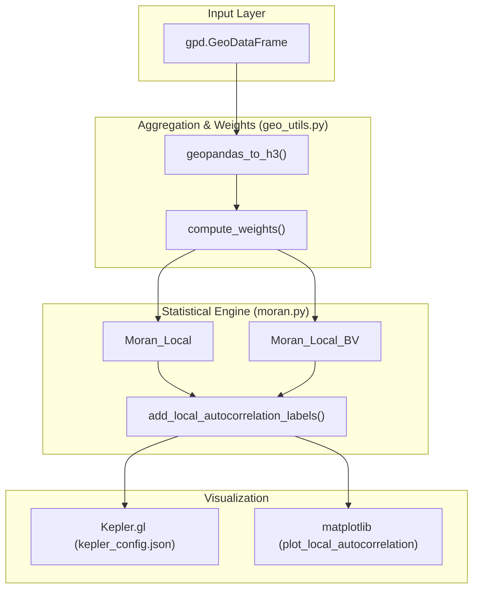
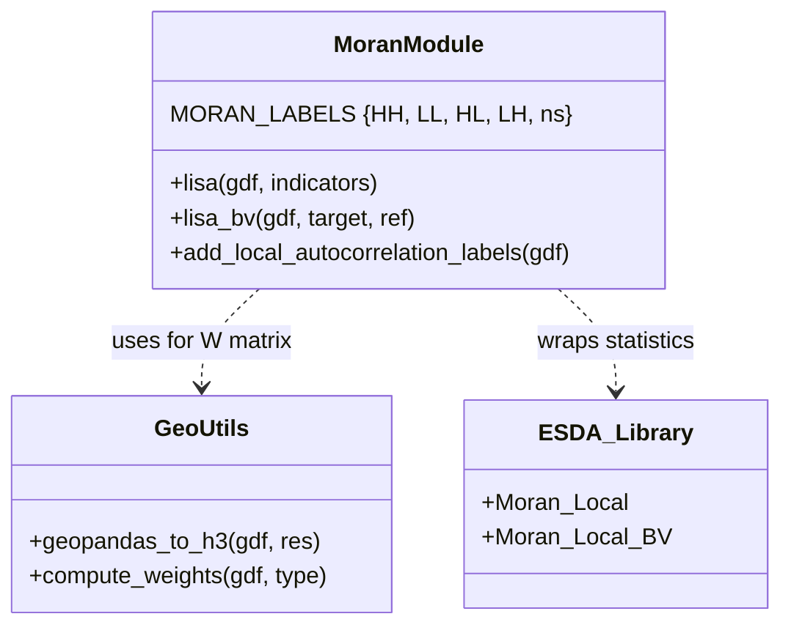

# Spatial Autocorrelation Module

The **Spatial Autocorrelation Module** provides the analytical framework for detecting spatial patterns and clusters within agricultural datasets. It enables researchers to identify "hotspots" (High-High) and "coldspots" (Low-Low) of soil properties, as well as spatial outliers (High-Low, Low-High), using Local Indicators of Spatial Association (LISA) and Moran's I statistics.

The module operates by aggregating irregular spatial data into H3 hexagonal grids, computing spatial weights matrices, and performing statistical tests to determine if observed spatial patterns are non-random.

### System Architecture

The following diagram illustrates the data flow from raw GeoDataFrames to classified spatial clusters:

**Spatial Autocorrelation Data Flow**

**Sources:** `app/spatial_autocorrelation/moran.py:35-117`, `app/spatial_autocorrelation/geo_utils.py:1-12`

---

### Core Components

#### 4.1 Moran Statistics & LISA Analysis
The engine for statistical computation is centered in `moran.py`. It leverages the `esda` (Exploratory Spatial Data Analysis) library to compute univariate and bivariate Moran's I.
- **Univariate LISA**: Identifies clusters of a single variable (e.g., pH levels) using `lisa()` `app/spatial_autocorrelation/moran.py:35-74`.
- **Bivariate LISA**: Identifies spatial correlations between two different variables (e.g., Nitrogen vs. Yield) using `lisa_bv()` `app/spatial_autocorrelation/moran.py:76-117`.
- **Classification**: Data points are categorized into `HH`, `LL`, `HL`, `LH`, or `ns` (non-significant) based on p-value thresholds `app/spatial_autocorrelation/moran.py:200-211`.

For details, see [Moran Statistics & LISA Analysis (moran.py)](05.1-lisa-engine.md).

#### 4.2 Geospatial Utilities
Before statistical analysis, data must be structured for spatial contiguity. The `geo_utils.py` module handles the transformation of geometries and the definition of "neighborhoods."
- **H3 Grid Aggregation**: Converts point or polygon data into standardized hexagonal bins using `geopandas_to_h3()` `app/spatial_autocorrelation/__init__.py:10`.
- **Spatial Weights**: Constructs the adjacency matrix (`W`) required for Moran's I. Supports **Queen contiguity** and **K-Nearest Neighbors (KNN)** via `compute_weights()` `app/spatial_autocorrelation/moran.py:67`.

For details, see [Geospatial Utilities (geo_utils.py)](05.2-geospatial-utilities.md).

#### 4.3 Autocorrelation Visualization
The results of the LISA analysis are visualized through two primary channels:
- **Static Plots**: Generated using `matplotlib` and `splot` for quick inspection of cluster distributions `app/spatial_autocorrelation/moran.py:119-167`.
- **Interactive Maps**: Integrated into the Streamlit UI via Kepler.gl. The `kepler_config.json` defines specific color mappings for the LISA quadrants (e.g., Red for HH, Blue for LL) to ensure consistent interpretation across the toolkit `app/spatial_autocorrelation/moran.py:215-223`.

For details, see [Autocorrelation Visualization (Kepler.gl Config)](05.3-autocorrelation-visualization.md).

---

### Code Entity Mapping

The following diagram maps the logical analysis steps to the specific Python functions and classes implemented in the module:

**Logic-to-Code Entity Map**

**Sources:** `app/spatial_autocorrelation/moran.py:16-32`, `app/spatial_autocorrelation/moran.py:169-225`, `app/spatial_autocorrelation/__init__.py:3-4`

---
