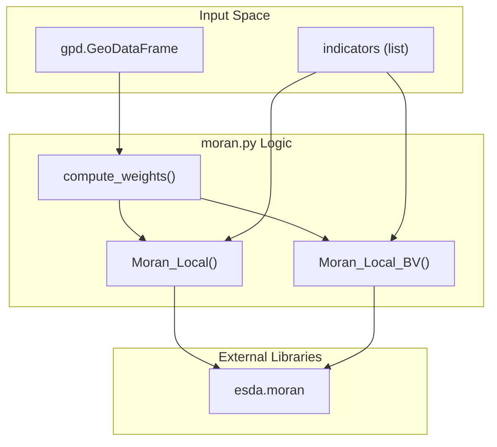
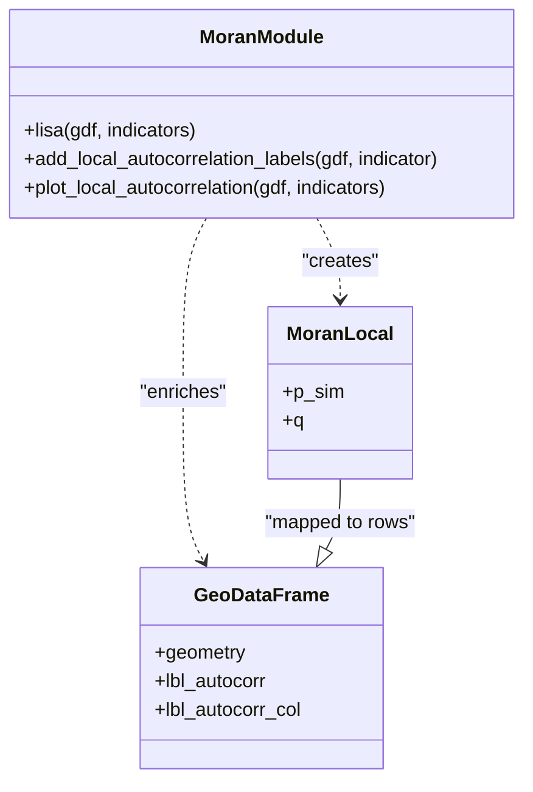

# Moran Statistics & LISA Analysis (moran.py)

The `moran.py` module provides the core analytical engine for spatial autocorrelation within the toolkit. It leverages the `esda` (Exploratory Spatial Data Analysis) library to compute global and local Moran's I statistics, enabling the identification of spatial clusters (hotspots/coldspots) and spatial outliers in agricultural data.

## Core Analysis Functions

The module implements both univariate and bivariate spatial association tests. These functions abstract the complexity of spatial weight matrices and statistical significance testing.

### Univariate LISA (`lisa`)
The `lisa` function calculates Local Indicators of Spatial Association `app/spatial_autocorrelation/moran.py:35-74`. It identifies how a single indicator (e.g., soil pH) correlates with itself across space.
*   **Local Mode**: Returns `Moran_Local` objects for each indicator, providing p-values and quadrant classifications for every geometry `app/spatial_autocorrelation/moran.py:70`.
*   **Global Mode**: Returns `Moran` objects representing the overall spatial clustering trend of the dataset `app/spatial_autocorrelation/moran.py:73`.

### Bivariate LISA (`lisa_bv`)
The `lisa_bv` function estimates spatial autocorrelation between a target attribute and the neighbors of a different reference attribute `app/spatial_autocorrelation/moran.py:76-117`. This is useful for analyzing the spatial relationship between two distinct variables, such as soil moisture and crop yield.

### Data Flow: Statistics Generation
The following diagram illustrates how raw spatial data is transformed into statistical objects using `moran.py`.

**LISA Analysis Data Flow**

Sources: `app/spatial_autocorrelation/moran.py:35-117`, `app/spatial_autocorrelation/moran.py:23-23`

## Spatial Weighting
All analysis functions depend on a spatial weights matrix `w`, generated via the `compute_weights` utility `app/spatial_autocorrelation/moran.py:67`.
*   **Queen Contiguity**: Defines neighbors as polygons sharing an edge or a corner.
*   **K-Nearest Neighbors (KNN)**: Defines neighbors based on the `k` closest centroids, where `k` defaults to 5 `app/spatial_autocorrelation/moran.py:39`.

Sources: `app/spatial_autocorrelation/moran.py:38-39`, `app/spatial_autocorrelation/moran.py:67-67`

## Quadrant Classification & Labeling

The toolkit classifies spatial associations into five categories based on the Moran scatterplot quadrants and statistical significance.

### Classification Logic
The `add_local_autocorrelation_labels` function performs the mapping from raw `Moran_Local` results to human-readable labels `app/spatial_autocorrelation/moran.py:169-226`.

| Label | Name | Description | Quadrant (`q`) |
| :--- | :--- | :--- | :--- |
| **HH** | High-High | Hotspot: High value surrounded by high values | 1 |
| **LH** | Low-High | Outlier: Low value surrounded by high values | 2 |
| **LL** | Low-Low | Coldspot: Low value surrounded by low values | 3 |
| **HL** | High-Low | Outlier: High value surrounded by low values | 4 |
| **ns** | Non-Significant | Values where p-value > threshold | N/A |

### Implementation Details
Significance is determined by comparing `lisa.p_sim` against a user-defined `p_value` (default 0.05) `app/spatial_autocorrelation/moran.py:201`.
*   **HH**: `(p_sim < p_value) & (q == 1)` `app/spatial_autocorrelation/moran.py:208`.
*   **HL**: `(p_sim < p_value) & (q == 2)` `app/spatial_autocorrelation/moran.py:209`. *Note: The code maps q=2 to HL and q=4 to LH for labeling.*
*   **LH**: `(p_sim < p_value) & (q == 4)` `app/spatial_autocorrelation/moran.py:210`.
*   **LL**: `(p_sim < p_value) & (q == 3)` `app/spatial_autocorrelation/moran.py:211`.

### Color Palette
For visualization (Kepler.gl and Matplotlib), the module assigns specific hex codes to labels `app/spatial_autocorrelation/moran.py:215-221`:
*   **HH**: `#FF0000` (Red)
*   **HL**: `#FFD580` (Light Orange)
*   **LH**: `#87CEEB` (Sky Blue)
*   **LL**: `#0074D9` (Dark Blue)
*   **ns**: `#D3D3D3` (Light Grey)

Sources: `app/spatial_autocorrelation/moran.py:169-226`, `app/spatial_autocorrelation/moran.py:26-32`

## Visualization Components

The module provides two primary ways to visualize autocorrelation:

1.  **Exploratory Plots**: `plot_local_autocorrelation` uses `splot` to generate standard Moran scatterplots and cluster maps for quick inspection `app/spatial_autocorrelation/moran.py:119-167`.
2.  **Labeled Maps**: `plot_autocorrelation_labels` renders a static Matplotlib figure of the GeoDataFrame using the calculated `lbl_autocorr` and `lbl_autocorr_col` columns `app/spatial_autocorrelation/moran.py:228-256`.

**Entity Mapping: Analysis to Visualization**

Sources: `app/spatial_autocorrelation/moran.py:119-167`, `app/spatial_autocorrelation/moran.py:169-226`, `app/spatial_autocorrelation/moran.py:228-256`

---
