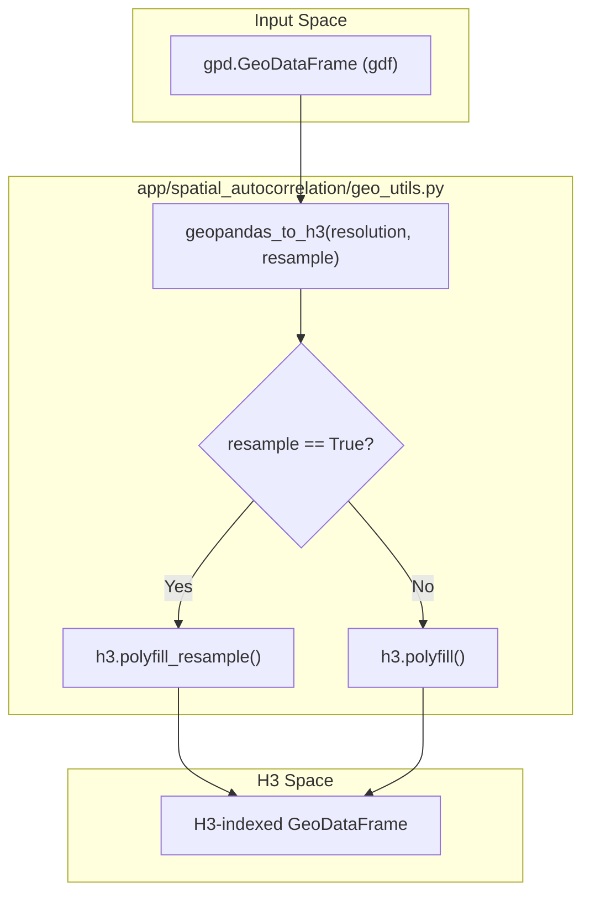
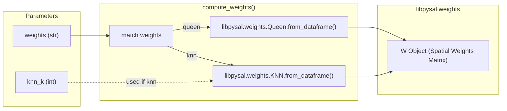

# Geospatial Utilities (geo_utils.py)

The `geo_utils.py` module provides essential geometric transformation and spatial relationship utilities required for spatial autocorrelation workflows. Its primary responsibilities include discretizing vector geometries into H3 hexagonal grids and generating spatial weight matrices (Queen contiguity or K-Nearest Neighbors) that define how observations interact across space.

### H3 Hexgrid Conversion

The toolkit utilizes the H3 indexing system to normalize irregular spatial data into a uniform hexagonal grid. This process is handled by `geopandas_to_h3`, which abstracts the `h3pandas` library to convert standard `GeoDataFrame` geometries into H3 cells at a specified resolution `app/spatial_autocorrelation/geo_utils.py:12-16`.

#### Polyfill vs. Resample
The function supports two distinct modes of operation based on the `resample` parameter:

| Mode | Function Called | Behavior |
| :--- | :--- | :--- |
| **Polyfill** | `h3.polyfill` | Fills the interior of polygons with H3 cells. This is typically used for defining boundaries `app/spatial_autocorrelation/geo_utils.py:41-41`. |
| **Resample** | `h3.polyfill_resample` | Performs a spatial join/aggregation during the filling process, which is essential for maintaining data attributes across the new hexgrid `app/spatial_autocorrelation/geo_utils.py:39-39`. |

#### Conversion Logic Flow
The following diagram illustrates the transformation from a standard `GeoDataFrame` to an H3-indexed representation used by the LISA pipeline.

**Data Flow: Vector to H3 Grid**

Sources: `app/spatial_autocorrelation/geo_utils.py:12-41`

---

### Spatial Weights Computation

To perform Local Indicators of Spatial Association (LISA) analysis, the system must define which hexagons are "neighbors." The `compute_weights` function acts as a factory for generating `libpysal.weights` objects `app/spatial_autocorrelation/geo_utils.py:44-48`.

#### Supported Weight Types
The module implements a `match` pattern to instantiate specific `libpysal` weight classes `app/spatial_autocorrelation/geo_utils.py:69-75`:

1.  **Queen Contiguity**: Neighbors are defined as polygons sharing at least one vertex or edge. This is the default method for the toolkit `app/spatial_autocorrelation/geo_utils.py:70-71`.
2.  **K-Nearest Neighbors (KNN)**: Neighbors are defined by the `k` closest observations based on centroid distance, regardless of contiguity. This is useful for sparse datasets `app/spatial_autocorrelation/geo_utils.py:72-73`.

#### Weights Factory Pattern
This diagram maps the natural language request for "spatial neighbors" to the specific `libpysal` implementations within the code.

**Entity Mapping: compute_weights Factory**

Sources: `app/spatial_autocorrelation/geo_utils.py:44-76`

---

### Integration with LISA Pipeline

The utilities in `geo_utils.py` serve as the preprocessing layer for the `moran.py` analysis engine. The output of these functions is directly consumed by the LISA calculation functions.

| Utility Output | Downstream Consumer | Purpose |
| :--- | :--- | :--- |
| `geopandas_to_h3` | `moran.lisa` / `moran.lisa_bv` | Provides the spatial units (hexagons) and aggregated values for Moran's I calculation. |
| `compute_weights` | `moran.lisa` / `moran.lisa_bv` | Defines the spatial lag ($Wy$) required to identify clusters (HH, LL) and outliers (HL, LH). |

**Process Sequence: Data Preparation for LISA**
1.  **Ingestion**: Raw field data is loaded into a `GeoDataFrame`.
2.  **Grid Generation**: `geopandas_to_h3` converts the field into a uniform hexgrid `app/spatial_autocorrelation/geo_utils.py:12`.
3.  **Topology Definition**: `compute_weights` builds the adjacency matrix `W` from the hexgrid `app/spatial_autocorrelation/geo_utils.py:44`.
4.  **Statistical Analysis**: The `W` object and H3 `GeoDataFrame` are passed to the LISA engine to calculate local autocorrelation.

Sources: `app/spatial_autocorrelation/geo_utils.py:1-77`

---
