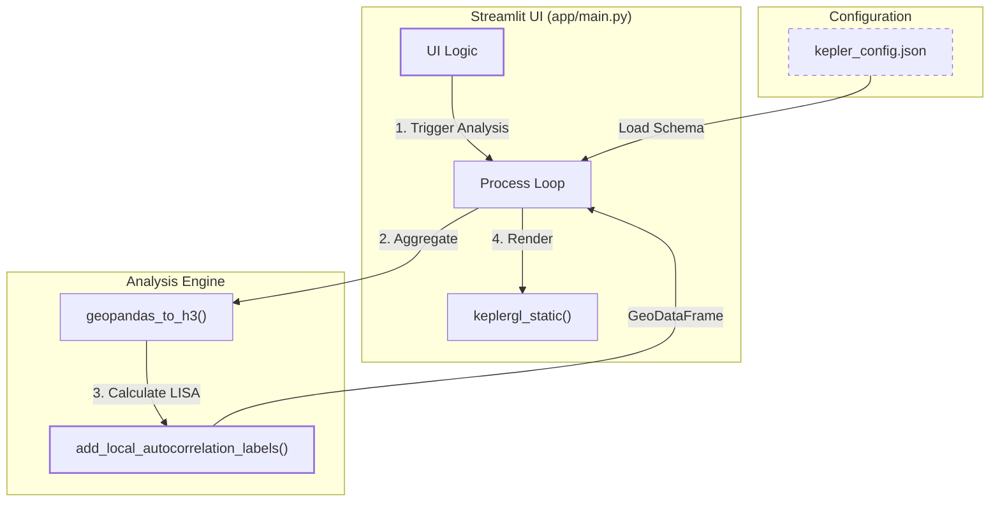
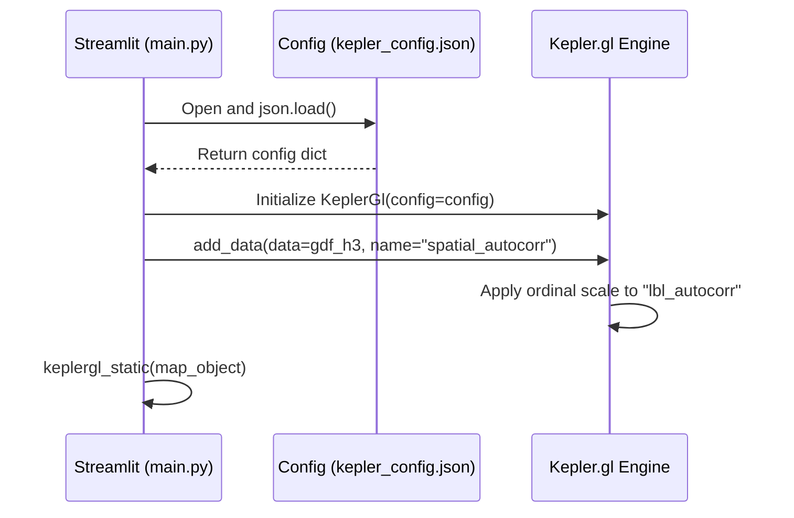

# Autocorrelation Visualization (Kepler.gl Config)

This page documents the technical implementation of the visualization layer for the Spatial Autocorrelation module. It focuses on the `kepler_config.json` schema, the mapping of LISA (Local Indicators of Spatial Association) clusters to visual styles, and the integration between the analysis engine and the Streamlit UI.

## Purpose and Scope

The visualization system is designed to provide an intuitive geographical representation of spatial clusters (HH, LL) and outliers (HL, LH). By utilizing H3 hexagonal bins and a standardized color palette, the toolkit allows users to identify regions of statistical significance in agricultural variables (e.g., soil pH, fertility) directly within the web interface.

## Kepler.gl Configuration Schema

The visualization is governed by a static configuration file located at `app/spatial_autocorrelation/kepler_config.json`. This file defines the layer hierarchy, color scales, and interaction behavior for the H3-aggregated autocorrelation data.

### Layer Definition: `spatial_autocorr`
The primary layer, identified as `spatial_autocorr`, is a `polygon` type layer configured to render the geometries produced by the autocorrelation pipeline `app/spatial_autocorrelation/kepler_config.json:6-9`.

| Property | Value | Description |
| :--- | :--- | :--- |
| `dataId` | `spatial_autocorr` | Matches the dataset ID provided in `app/main.py` |
| `type` | `polygon` | Renders the geometry column as filled polygons |
| `opacity` | `0.8` | Provides transparency to see underlying satellite imagery |
| `filled` | `true` | Enables color fills for cluster categories |
| `extruded` | `false` | 2D representation (3D height is disabled by default) |

Sources: `app/spatial_autocorrelation/kepler_config.json:7-19`, `app/spatial_autocorrelation/kepler_config.json:51-52`

### Visual Channels and Color Mapping
The configuration uses an `ordinal` color scale mapped to the `lbl_autocorr` field `app/spatial_autocorrelation/kepler_config.json:67-71`. This field is generated by the `add_local_autocorrelation_labels` function in the analysis module.

**Categorical Color Palette:**
The `colorRange` defines a custom palette for the five standard LISA categories `app/spatial_autocorrelation/kepler_config.json:22-33`:

| Hex Code | LISA Category | Interpretation |
| :--- | :--- | :--- |
| `#FF0000` | **HH** (High-High) | Hot spots: High values surrounded by high values |
| `#FFD580` | **HL** (High-Low) | Outliers: High values surrounded by low values |
| `#87CEEB` | **LH** (Low-High) | Outliers: Low values surrounded by high values |
| `#0074D9` | **LL** (Low-Low) | Cold spots: Low values surrounded by low values |
| `#D3D3D3` | **ns** (Not Sig.) | No statistically significant spatial pattern |

Sources: `app/spatial_autocorrelation/kepler_config.json:26-32`, `app/spatial_autocorrelation/moran.py:108-114`

## Data Flow: Analysis to Visualization

The integration involves transforming raw field data into H3 hexagonal aggregates, calculating Moran's I statistics, and injecting the resulting GeoDataFrame into the Kepler.gl instance.

### System Integration Diagram
This diagram illustrates how the code entities in `main.py` interact with the autocorrelation utilities and the JSON configuration.

**Autocorrelation Data Pipeline**

Sources: `app/main.py:612-645`, `app/spatial_autocorrelation/moran.py:126-140`, `app/spatial_autocorrelation/geo_utils.py:12-25`

### Mapping Logic
The `add_local_autocorrelation_labels` function acts as the bridge between statistical output and the visualization config by creating the `lbl_autocorr` column expected by the Kepler layer `app/spatial_autocorrelation/moran.py:136-138`.

**Entity Mapping Table**
| Code Entity | Role | Reference |
| :--- | :--- | :--- |
| `lisa` / `lisa_bv` | Computes Local Moran statistics | `app/spatial_autocorrelation/moran.py:14-100` |
| `lbl_autocorr` | Data column used as `colorField` in Kepler | `app/spatial_autocorrelation/kepler_config.json:68` |
| `spatial_autocorr` | Dataset ID and Layer ID | `app/spatial_autocorrelation/kepler_config.json:8-11` |
| `kepler_config.json` | Defines `visState` and `mapStyle` | `app/spatial_autocorrelation/kepler_config.json:4-113` |

## UI Integration in `main.py`

The Streamlit application handles the loading of the configuration and the instantiation of the map component.

1.  **Config Loading**: The application reads the JSON file into a Python dictionary `app/main.py:612-615`.
2.  **Map Initialization**: A `KeplerGl` object is created with the loaded config `app/main.py:641`.
3.  **Data Injection**: The H3-aggregated GeoDataFrame (containing the `lbl_autocorr` column) is added to the map object using the `dataId` "spatial_autocorr" `app/main.py:642`.
4.  **Static Rendering**: The map is rendered in the UI via `keplergl_static` `app/main.py:643`.

### Interaction Configuration
The `interactionConfig` within the JSON enables tooltips that display the H3 cell ID and the autocorrelation category when a user hovers over the map `app/spatial_autocorrelation/kepler_config.json:79-85`. The map style is set to `satellite` to provide agricultural context `app/spatial_autocorrelation/kepler_config.json:114`.

**Visualization Component Interaction**

Sources: `app/main.py:612-643`, `app/spatial_autocorrelation/kepler_config.json:66-76`

---
