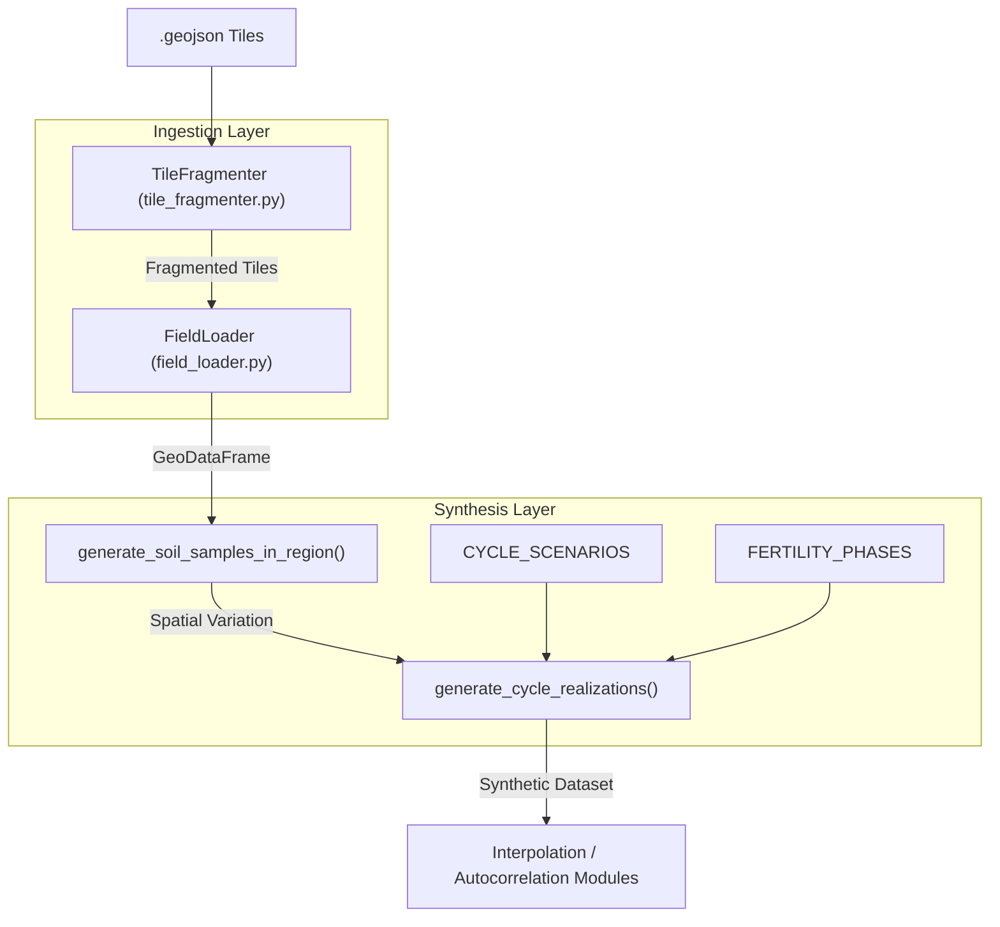
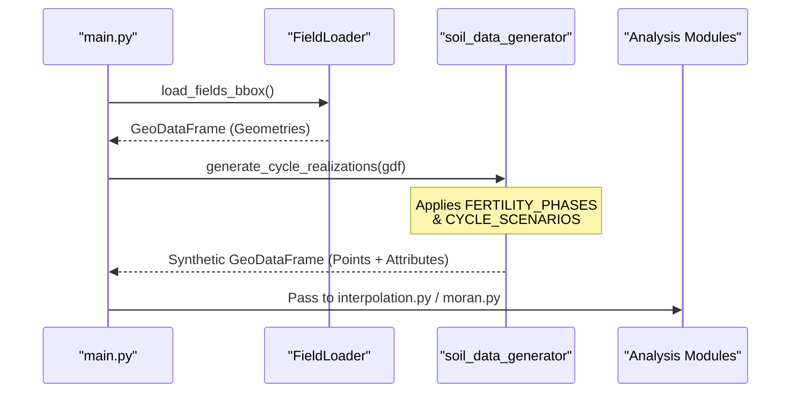

# Data Synthesis Module

The **Data Synthesis Module** is the foundational subsystem responsible for providing the spatial and attribute data required by the interpolation and autocorrelation engines. It handles the ingestion of physical field geometries and the generation of synthetic agronomic time-series data `app/data_synthesis/__init__.py:1-7`.

This module bridges the gap between static geospatial vectors (GeoJSON) and dynamic soil property simulations, allowing users to analyze agricultural scenarios across different fertility phases and climatic cycles `app/data_synthesis/__init__.py:11-17`.

### System Architecture

The module is organized into three primary functional areas:
1.  **Field Ingestion**: Efficient loading of large-scale field geometries using spatial indexing.
2.  **Stochastic Generation**: Creation of synthetic soil samples (pH, Organic Matter, etc.) based on mathematical models of spatial variation.
3.  **Data Partitioning**: Fragmentation of large datasets into manageable tiles to optimize memory usage and processing speed.

#### Code Entity Map: Synthesis Workflow
The following diagram illustrates how the primary classes and functions within `app/data_synthesis/` interact to produce the datasets used by the rest of the toolkit.

**Sources:** `app/data_synthesis/__init__.py:9-29`

---

### Key Components

#### 1. Soil Data Generator
The soil generation engine simulates realistic agricultural data. It uses a combination of sinusoidal formulas for spatial variation and linear interpolation (`np.linspace`) to create "realizations"—different snapshots of soil health over time. It supports various `FERTILITY_PHASES` (e.g., depletion, recovery) and `CYCLE_SCENARIOS` (e.g., drought, intensive farming) `app/data_synthesis/__init__.py:11-17`.

For detailed documentation on the mathematical models and soil property schemas, see **[Soil Data Generator (soil_data_generator.py)](06.2-soil-data-generator.md)**.

#### 2. Field Loader
The `FieldLoader` class is responsible for spatial discovery and OOM (Out of Memory) safe data loading. It manages coordinate reference systems (CRS) and provides methods to load fields based on bounding boxes (`load_fields_bbox`) or zoom levels (`load_fields_zoom_level`) `app/data_synthesis/field_loader.py:9`.

For details on tile discovery and spatial index management, see **[Field Loader (field_loader.py)](06.1-field-loader.md)**.

#### 3. Tile Fragmentation
To handle high-resolution agricultural data without crashing the application, the `TileFragmenter` breaks down large GeoJSON files into smaller, spatially-indexed fragments. This process uses a grid-based centroid assignment algorithm to ensure fields are assigned to the correct sub-tile `app/data_synthesis/tile_fragmenter.py:19`.

For details on the fragmentation CLI and file naming conventions, see **[Tile Fragmentation (tile_fragmenter.py & scripts/)](06.3-tile-fragmenter.md)**.

---

### Data Synthesis to Analysis Pipeline
The synthesis module serves as the entry point for the entire application's data flow. The generated realizations are structured specifically to be consumed by the R-based interpolation scripts and the H3-based autocorrelation utilities.

**Sources:** `app/data_synthesis/__init__.py:1-30`

---
