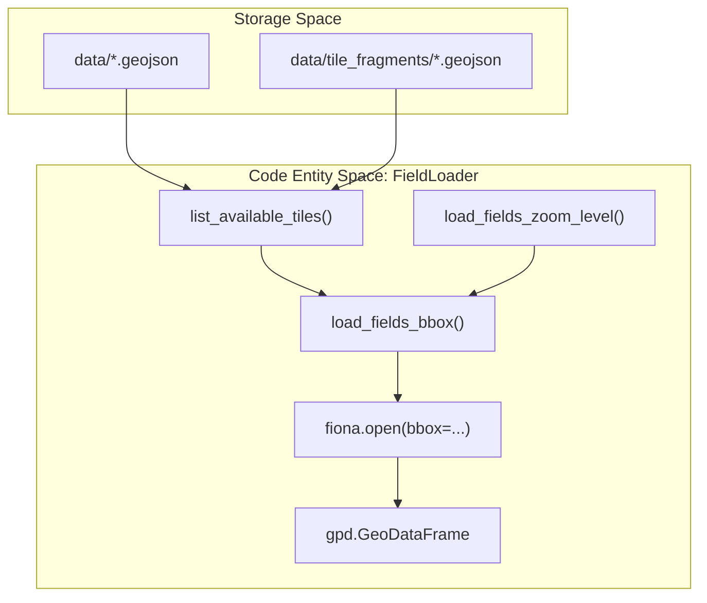
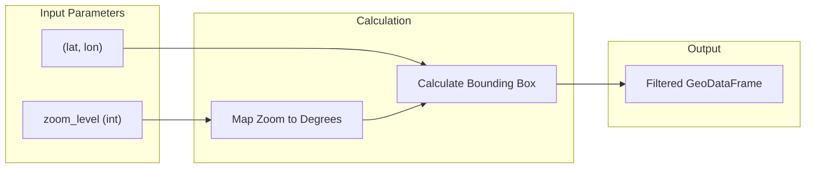

# Field Loader (field_loader.py)

The `FieldLoader` class is the primary interface for loading and filtering delineated field geometries from the `data/` directory. It is designed to handle large geospatial datasets by implementing efficient tile discovery, bounding box (bbox) streaming, and memory-safe loading limits.

### Purpose and Scope
`FieldLoader` abstracts the complexity of managing fragmented GeoJSON files. It allows the application to:
*   **Discover Tiles**: Automatically detect both top-level GeoJSON files and fragmented sub-tiles within directories `app/data_synthesis/field_loader.py:44-79`.
*   **Efficient Loading**: Use `fiona` to stream features that intersect a specific geographic bounding box, avoiding the need to load entire files into memory `app/data_synthesis/field_loader.py:122-139`.
*   **Coordinate Management**: Ensure all loaded fields are projected to a consistent Coordinate Reference System (CRS) `app/data_synthesis/field_loader.py:148-150`.
*   **Memory Safety**: Enforce `max_fields` limits to prevent Out-of-Memory (OOM) errors during the synthesis process `app/data_synthesis/field_loader.py:86, 137-138`.

---

### System Architecture & Data Flow

The following diagram illustrates how `FieldLoader` bridges the file system (Natural Language/Storage Space) to the internal GeoDataFrames (Code Entity Space).

**Field Loading Pipeline**

**Sources:** `app/data_synthesis/field_loader.py:16-104`

---

### Key Implementation Details

#### 1. Tile Discovery Strategy
The `list_available_tiles` method scans `self.base_dir` for two types of data structures:
1.  **Top-level files**: Standard `.geojson` files that are not hidden and do not contain the "fragment" keyword `app/data_synthesis/field_loader.py:57-60`.
2.  **Fragmented Tiles**: Subdirectories containing multiple `.geojson` files with "fragment" in their name. These are typically generated by the `TileFragmenter` `app/data_synthesis/field_loader.py:63-77`.

#### 2. Spatial Filtering and OOM Safety
To handle datasets that may contain tens of thousands of polygons, `load_fields_bbox` employs a tiered loading strategy:

| Feature | Implementation | Purpose |
| :--- | :--- | :--- |
| **Fiona Streaming** | `fiona.open(filepath, bbox=bbox)` | Only reads features from disk that intersect the target area `app/data_synthesis/field_loader.py:132-133`. |
| **Hard Limit** | `max_fields` (default 5000) | Aborts loading if the feature count exceeds the threshold to protect system RAM `app/data_synthesis/field_loader.py:136-138`. |
| **Spatial Index Fallback** | `gdf.sindex.intersection` | If fiona streaming fails, loads the file and uses a spatial index (R-tree) for fast filtering `app/data_synthesis/field_loader.py:175-180`. |

#### 3. Zoom-to-Degree Mapping
The `load_fields_zoom_level` function calculates a bounding box centered on a point `(lat, lon)` based on a zoom level. This mimics web-map behavior where higher zoom levels result in smaller geographic footprints `app/data_synthesis/field_loader.py:195-217`.

**Zoom Level Mapping Logic**

**Sources:** `app/data_synthesis/field_loader.py:195-236`

---

### Class Methods Reference

| Method | Description |
| :--- | :--- |
| `__init__(base_dir)` | Sets the directory for data lookup. Defaults to the project's `data/` folder `app/data_synthesis/field_loader.py:25-42`. |
| `list_available_tiles()` | Returns a sorted list of all loadable GeoJSON files and fragments `app/data_synthesis/field_loader.py:44-79`. |
| `load_fields_bbox(...)` | The core loading logic. Uses `fiona` for bbox-filtered streaming `app/data_synthesis/field_loader.py:81-155`. |
| `load_fields_zoom_level(...)` | Wrapper for `load_fields_bbox` that calculates the bbox size based on a zoom level (0-20) `app/data_synthesis/field_loader.py:195-236`. |
| `load_properties_csv(...)` | Loads auxiliary property data from CSV files, typically used for joining soil attributes to field geometries `app/data_synthesis/field_loader.py:238-267`. |

**Sources:** `app/data_synthesis/field_loader.py:16-267`

---
