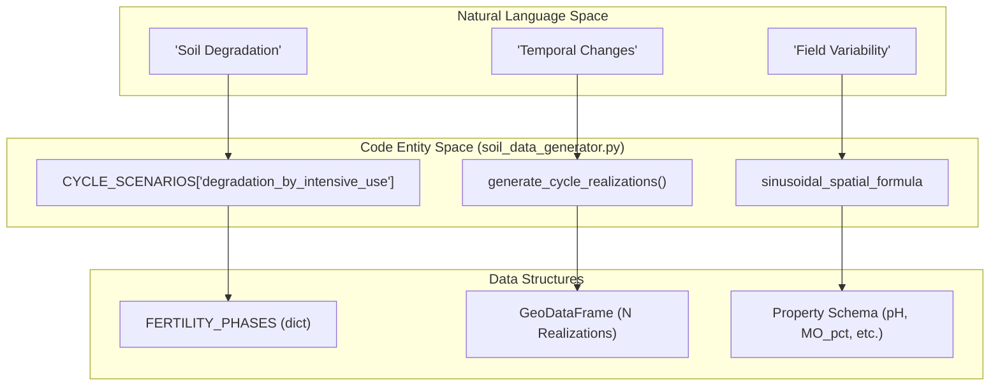
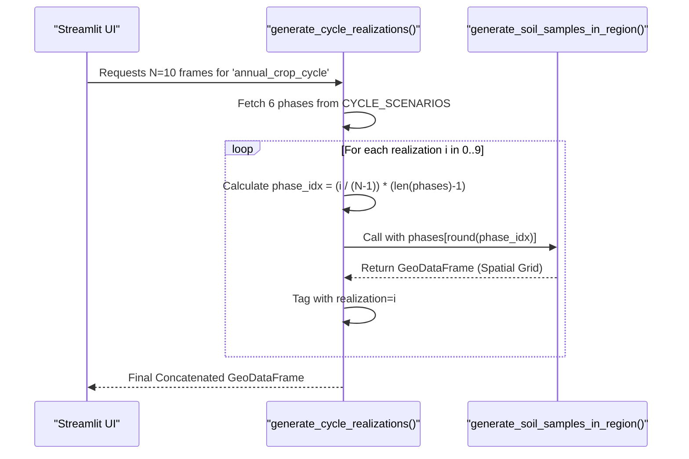

# Soil Data Generator (soil_data_generator.py)

The Soil Data Generator is responsible for synthesizing realistic, multi-temporal soil property datasets. It simulates agronomic cycles—such as degradation, recovery, and salinization—across a geographic region by applying spatial variation logic and temporal interpolation. This module provides the synthetic ground truth used by the interpolation and autocorrelation subsystems.

### Core Logic and Implementation

The generator operates by mapping discrete "Fertility Phases" into continuous temporal "Realizations" using a scenario-based approach.

#### 1. Fertility Phases and Scenarios
The system defines a library of `FERTILITY_PHASES` `app/data_synthesis/soil_data_generator.py:21-71`, each containing statistical ranges for key soil properties:
*   **pH**: Potential of Hydrogen.
*   **MO_pct**: Organic Matter percentage.
*   **CIC_cmol**: Cation Exchange Capacity.
*   **SatBases_pct**: Base Saturation percentage.
*   **Indices**: `fertility_idx` and `degradation_idx` used for risk assessment.

These phases are sequenced into `CYCLE_SCENARIOS` `app/data_synthesis/soil_data_generator.py:79-184`. For example, the `degradation_by_intensive_use` scenario sequences phases from `alta_fertilidad` down to `muy_baja_fertilidad` `app/data_synthesis/soil_data_generator.py:80-95`.

#### 2. Spatial Variation Engine
To prevent perfectly uniform fields, the generator applies a sinusoidal spatial variation formula. For any property $P$ at coordinates $(x, y)$, the value is calculated as:

$$Value = Base + (Amplitude \times \sin(Frequency \times x + Phase) \times \cos(Frequency \times y + Phase))$$

This logic is implemented within `generate_soil_samples_in_region` `app/data_synthesis/soil_data_generator.py:246-271`, where:
*   `Base` is the midpoint of the phase range `app/data_synthesis/soil_data_generator.py:262-263`.
*   `Amplitude` is half the range width `app/data_synthesis/soil_data_generator.py:264-265`.
*   A random noise component is added to ensure local heterogeneity `app/data_synthesis/soil_data_generator.py:270`.

#### 3. Temporal Realization Interpolation
The function `generate_cycle_realizations` `app/data_synthesis/soil_data_generator.py:284-350` bridges the gap between discrete phases and the user-requested number of frames ($N$). It uses `np.linspace` to determine which phase (or interpolation between phases) applies to each realization `app/data_synthesis/soil_data_generator.py:326-328`.

**Sources:** `app/data_synthesis/soil_data_generator.py:21-350`

---

### System Architecture: Data Synthesis Flow

The following diagram illustrates how natural language agronomic concepts are translated into code entities and data structures.

**Natural Language to Code Entity Map**

**Sources:** `app/data_synthesis/soil_data_generator.py:21-184`, `app/data_synthesis/soil_data_generator.py:284-300`

---

### Key Functions

#### `generate_soil_samples_in_region`
Generates a single snapshot of soil data. It creates a grid of points within a bounding box and assigns soil properties based on a selected `fertility_phase`.

*   **Inputs**: Bounding box, number of samples, phase key.
*   **Logic**: Iterates through the property schema, applying the spatial variation formula to each point `app/data_synthesis/soil_data_generator.py:255-271`.
*   **Output**: `gpd.GeoDataFrame` containing points and their chemical attributes.

#### `generate_cycle_realizations`
The primary entry point for multi-temporal data.
1.  Retrieves the sequence of phases from the chosen `scenario_id` `app/data_synthesis/soil_data_generator.py:313-317`.
2.  Calculates the "active phase" for each realization $i \in \{0 \dots N-1\}$ `app/data_synthesis/soil_data_generator.py:326-330`.
3.  Calls `generate_soil_samples_in_region` for each realization `app/data_synthesis/soil_data_generator.py:334-340`.
4.  Appends a `realization` column to track the time step `app/data_synthesis/soil_data_generator.py:341`.

**Sources:** `app/data_synthesis/soil_data_generator.py:212-350`

---

### Data Schema and Risk Indicators

The generator outputs a GeoDataFrame with a specific schema. In addition to chemical properties, it calculates derived risk indicators used for visualization in the UI.

| Column | Description | Source Logic |
| :--- | :--- | :--- |
| `pH` | Soil acidity/alkalinity | Sinusoidal + Noise `app/data_synthesis/soil_data_generator.py:266` |
| `MO_pct` | Organic Matter % | Sinusoidal + Noise `app/data_synthesis/soil_data_generator.py:266` |
| `fertility_idx` | Numeric 1-5 scale | Derived from `FERTILITY_PHASES` `app/data_synthesis/soil_data_generator.py:23` |
| `degradation_idx`| Numeric 0-4 scale | Derived from `FERTILITY_PHASES` `app/data_synthesis/soil_data_generator.py:23` |
| `risk_score` | Combined risk metric | `degradation_idx` + random variance `app/data_synthesis/soil_data_generator.py:274-275` |

**Sources:** `app/data_synthesis/soil_data_generator.py:21-71`, `app/data_synthesis/soil_data_generator.py:273-280`

---

### Execution Logic: Temporal Interpolation

The diagram below details the internal logic of `generate_cycle_realizations` and how it handles the mapping of phases to frames.

**Temporal Mapping Process**

**Sources:** `app/data_synthesis/soil_data_generator.py:284-350`, `app/data_synthesis/soil_data_generator.py:139-154`

---
