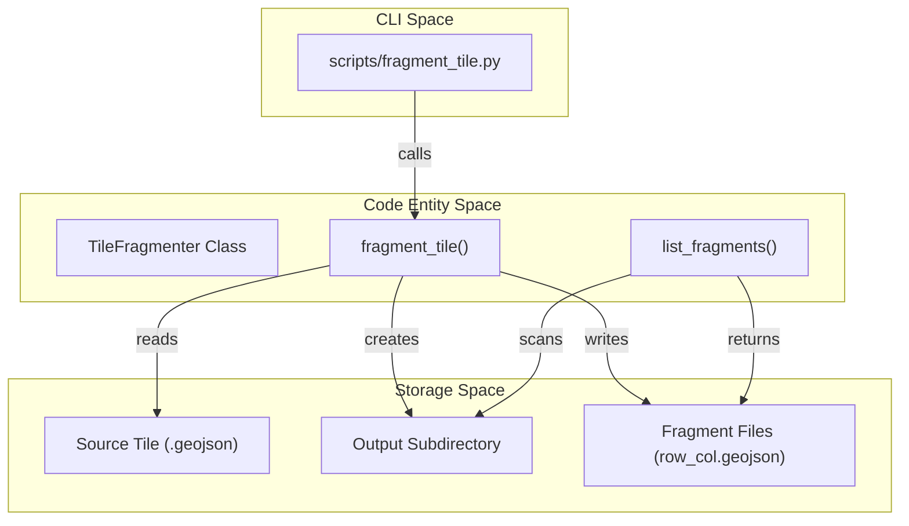
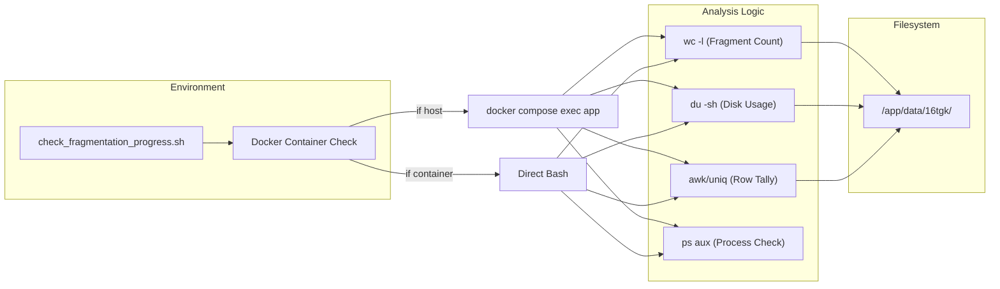

# Tile Fragmentation (tile_fragmenter.py & scripts/)

The Tile Fragmentation module provides the infrastructure to subdivide large GeoJSON tiles into smaller, spatially-indexed fragments. This process is critical for optimizing the performance of the Streamlit application, as it allows for partial data loading based on the user's current viewport or zoom level, preventing Out-of-Memory (OOM) errors and reducing rendering latency `app/data_synthesis/tile_fragmenter.py:1-6`.

## TileFragmenter Class

The `TileFragmenter` class is the core engine responsible for spatial partitioning. It uses a grid-based approach to split a source GeoJSON file into a set of smaller GeoJSON files, maintaining the original coordinate reference system (CRS) and property schema `app/data_synthesis/tile_fragmenter.py:16-19`.

### Grid-Based Centroid Assignment Algorithm

To ensure that every feature from the source tile is assigned to exactly one fragment (avoiding duplication at fragment boundaries), the module employs a **Centroid Assignment Algorithm** `app/data_synthesis/tile_fragmenter.py:102-104`:

1.  **Bounds Calculation**: The total spatial extent (min_lon, min_lat, max_lon, max_lat) of the source tile is retrieved using `fiona` `app/data_synthesis/tile_fragmenter.py:76-81`.
2.  **Grid Partitioning**: The extent is divided into a $N \times N$ grid based on the `grid_size` parameter `app/data_synthesis/tile_fragmenter.py:84-87`.
3.  **Spatial Filtering**: For each grid cell:
    *   A bounding box filter is applied to the source file to fetch candidate features `app/data_synthesis/tile_fragmenter.py:108-109`.
    *   The **centroid** of each candidate feature's geometry is calculated using `shapely` `app/data_synthesis/tile_fragmenter.py:112-114`.
    *   A feature is only written to the fragment if its **centroid is contained within the cell's geometry** `app/data_synthesis/tile_fragmenter.py:115-116`.
4.  **Schema Preservation**: Each fragment is written using the exact `schema` and `crs` of the parent file to ensure downstream compatibility `app/data_synthesis/tile_fragmenter.py:127-135`.

### TileFragmenter Class Logic
The following diagram maps the logical flow of the `fragment_tile` method to the specific code entities involved.

| Logic Step | Code Entity | File Reference |
| :--- | :--- | :--- |
| **Input Parsing** | `fragment_tile(tile_name, grid_size)` | `app/data_synthesis/tile_fragmenter.py:38-43` |
| **Metadata Extraction** | `fiona.open(filepath).bounds` | `app/data_synthesis/tile_fragmenter.py:76-79` |
| **Grid Iteration** | `for row in range(grid_size)` | `app/data_synthesis/tile_fragmenter.py:92-93` |
| **Spatial Check** | `cell_geom.contains(centroid)` | `app/data_synthesis/tile_fragmenter.py:115` |
| **File Writing** | `dst.writerecords(features)` | `app/data_synthesis/tile_fragmenter.py:135` |

**Sources:** `app/data_synthesis/tile_fragmenter.py:16-140`

## File Naming and Structure

Fragments are organized into subdirectories within the project's `data/` directory.

*   **Directory Naming**: By default, the output directory name is derived from the tile name by removing standard prefixes like `_demo_crop_fd_` `app/data_synthesis/tile_fragmenter.py:67-71`.
*   **Fragment Naming**: Fragments follow the convention `{subdir}_fragment_{row}_{col}.geojson`, where `row` and `col` are zero-padded integers `app/data_synthesis/tile_fragmenter.py:124`.

### Fragment Data Flow
This diagram bridges the CLI interface to the internal file system operations.


**Sources:** `app/data_synthesis/tile_fragmenter.py:38-166`, `scripts/fragment_tile.py:19-41`

## CLI Utilities

### fragment_tile.py
A Python wrapper that allows developers to trigger fragmentation from the command line. It accepts the tile filename and an optional grid size (defaulting to 4x4) `scripts/fragment_tile.py:24-31`.

**Example Usage:**
```bash
python scripts/fragment_tile.py _demo_crop_fd_16tgk_10091004_v1.geojson 8
```
**Sources:** `scripts/fragment_tile.py:1-51`

### check_fragmentation_progress.sh
A shell utility designed to monitor the status of fragmentation tasks, particularly useful for long-running processes or when running inside a Docker container `scripts/check_fragmentation_progress.sh:1-6`.

**Key Features:**
*   **Environment Detection**: Automatically detects if it is running on the host or inside a Docker container to adjust paths and commands `scripts/check_fragmentation_progress.sh:5-14`.
*   **Progress Tracking**: Calculates the percentage of completed fragments based on an expected $8 \times 8$ grid `scripts/check_fragmentation_progress.sh:34-40`.
*   **Row-wise Analysis**: Aggregates fragments by row index to identify if the process stalled at a specific spatial band `scripts/check_fragmentation_progress.sh:24-30`.
*   **Process Monitoring**: Checks the system process list for active `fragment_tile` instances `scripts/check_fragmentation_progress.sh:25-31`.

### Fragmentation Monitoring Flow
This diagram illustrates how the shell script interacts with the environment and the data directory.


**Sources:** `scripts/check_fragmentation_progress.sh:1-75`

## Key Functions Reference

| Function | Purpose | Location |
| :--- | :--- | :--- |
| `__init__` | Sets the project root and `data/` directory path. | `app/data_synthesis/tile_fragmenter.py:21-36` |
| `fragment_tile` | Main entry point for spatial partitioning logic. | `app/data_synthesis/tile_fragmenter.py:38-140` |
| `list_fragments` | Returns a sorted list of GeoJSON fragments found in a tile's subdirectory. | `app/data_synthesis/tile_fragmenter.py:142-166` |
| `get_fragment_bounds` | Uses `fiona` to retrieve the spatial bounding box of a specific fragment. | `app/data_synthesis/tile_fragmenter.py:168-188` |

**Sources:** `app/data_synthesis/tile_fragmenter.py:21-188`

---
