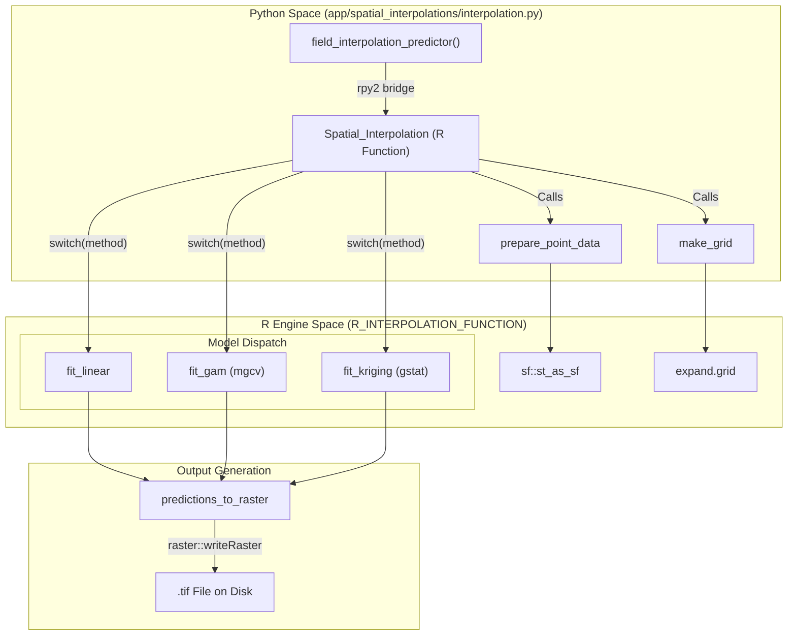
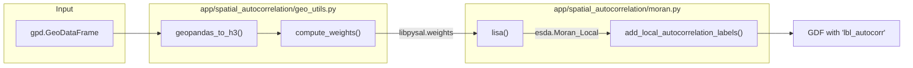

# Glossary

This page provides a comprehensive reference of domain-specific terminology, technical concepts, and implementation details used within the Spatial Agriculture Toolkit. It bridges agronomic theory with the specific code entities that realize these concepts.

## 1. Core Spatial Concepts

### Analysis Region ($\mathcal{R}$)
The bounded 2D geographic area where spatial models operate. In the toolkit, this is typically defined as a GeoJSON Polygon. It serves as the bounding geometry for both synthetic data generation and the interpolation grid extent.
*   **Implementation**: Used to clip generated points and define the `raster` extent in R.
*   **Sources**: `app/spatial_interpolations/interpolation.py:159-162`, `app/data_synthesis/soil_data_generator.py:4-8`

### Planar Point Pattern (PPP)
A set of spatial observations $(x, y)$ where each point represents an event (e.g., a soil sample) occurring within the region $\mathcal{R}$.
*   **Implementation**: Handled as a `pandas.DataFrame` in Python and converted to an `sf` object or `SpatialPointsDataFrame` in R.
*   **Sources**: `app/spatial_interpolations/interpolation.py:58-70`, `app/spatial_interpolations/interpolation.py:134-136`

### H3 Hexgrid
A hierarchical geospatial indexing system that partitions the world into hexagonal cells. The toolkit uses H3 to aggregate irregular field data into a uniform grid for spatial autocorrelation analysis.
*   **Implementation**: Handled via the `h3pandas` library.
*   **Key Functions**: `geopandas_to_h3` (utilizing `polyfill` and `polyfill_resample`).
*   **Sources**: `app/spatial_autocorrelation/geo_utils.py:12-41`

## 2. Spatial Interpolation Methods

The toolkit utilizes an R-based engine to predict probabilities across a continuous surface.

| Term | Definition | Code Entity |
| :--- | :--- | :--- |
| **GAM** | Generalized Additive Model using Thin Plate splines (`bs = "tp"`) for flexible spatial trends. | `fit_gam` `app/spatial_interpolations/interpolation.py:120-129` |
| **Indicator Kriging** | Geostatistical interpolation that predicts the probability of exceeding a threshold. | `fit_kriging` `app/spatial_interpolations/interpolation.py:131-155` |
| **Orthogonal Polynomials** | A GLM strategy using `poly(lon, 3) * poly(lat, 3)` to model complex curved surfaces. | `fit_orthogonal` `app/spatial_interpolations/interpolation.py:108-112` |
| **B-Splines** | Basis splines used within a GLM to capture local spatial variations. | `fit_splines` `app/spatial_interpolations/interpolation.py:114-118` |

### Interpolation Data Flow
The following diagram illustrates the bridge between the Python UI/Data layer and the R Statistical Engine.

**Spatial Interpolation Bridge (Python to R)**

**Sources**: `app/spatial_interpolations/interpolation.py:47-194`

## 3. Spatial Autocorrelation (LISA)

### LISA (Local Indicators of Spatial Association)
Statistics that identify local clusters (hotspots/coldspots) or spatial outliers. 
*   **Implementation**: Uses the `esda` library (PySAL).
*   **Sources**: `app/spatial_autocorrelation/moran.py:35-66`

### Quadrant Classifications
The classification of spatial association for a feature and its neighbors:
*   **HH (High-High)**: High value surrounded by high values (Hotspot).
*   **LL (Low-Low)**: Low value surrounded by low values (Coldspot).
*   **HL (High-Low)**: High value surrounded by low values (Spatial Outlier).
*   **LH (Low-High)**: Low value surrounded by high values (Spatial Outlier).
*   **ns (Non-Significant)**: No statistically significant spatial pattern.
*   **Sources**: `app/spatial_autocorrelation/moran.py:207-212`, `app/spatial_autocorrelation/moran.py:26-32`

### Spatial Weights Matrix ($W$)
A representation of the geographic relationships between observations.
*   **Queen Contiguity**: Features are neighbors if they share an edge or a vertex.
*   **KNN (K-Nearest Neighbors)**: Features are neighbors based on the $K$ closest centroids.
*   **Sources**: `app/spatial_autocorrelation/geo_utils.py:44-76`

**LISA Analysis Pipeline**

**Sources**: `app/spatial_autocorrelation/moran.py:169-225`, `app/spatial_autocorrelation/geo_utils.py:44-76`

## 4. Data Synthesis & Management

### Agronomic Cycle
A sequence of **Fertility Phases** (e.g., `alta_fertilidad` $\rightarrow$ `baja_fertilidad`) that simulate the temporal evolution of soil health.
*   **Implementation**: Defined in `CYCLE_SCENARIOS`.
*   **Sources**: `app/data_synthesis/soil_data_generator.py:79-184`

### Realization
A single "frame" or temporal snapshot in a sequence of synthetic data. If a user requests 10 realizations, the toolkit generates 10 sets of points, each representing a step in the selected agronomic cycle.
*   **Implementation**: Managed by `generate_cycle_realizations`.
*   **Sources**: `app/data_synthesis/soil_data_generator.py:254-315`

### Tile Fragmentation
The process of splitting a large GeoJSON "tile" (e.g., a whole county or region) into smaller, spatially-indexed fragments to prevent memory overflow (OOM) in the Streamlit application.
*   **Class**: `TileFragmenter`
*   **Logic**: Uses a grid-based approach where features are assigned to fragments based on their **centroid** to avoid duplication.
*   **Sources**: `app/data_synthesis/tile_fragmenter.py:16-140`

### Field Loader
The interface for accessing fragmented or top-level GeoJSON data. It uses `fiona` for streaming features with a bounding box (`bbox`) filter.
*   **Class**: `FieldLoader`
*   **Sources**: `app/data_synthesis/field_loader.py:16-155`

## 5. Technical Abbreviations

| Abbreviation | Full Term | Context |
| :--- | :--- | :--- |
| **CRS** | Coordinate Reference System | Usually `EPSG:4326` (WGS84) in this toolkit. `app/data_synthesis/field_loader.py:85` |
| **GDF** | GeoDataFrame | The primary data structure for spatial vectors (GeoPandas). `app/spatial_autocorrelation/geo_utils.py:13` |
| **REML** | Restricted Maximum Likelihood | Estimation method used in GAM fitting. `app/spatial_interpolations/interpolation.py:124` |
| **MO_pct** | Organic Matter Percentage | Soil property generated in synthetic data. `app/data_synthesis/soil_data_generator.py:24` |
| **CIC_cmol** | Cation Exchange Capacity | Soil property (cmol/kg) generated in synthetic data. `app/data_synthesis/soil_data_generator.py:25` |
