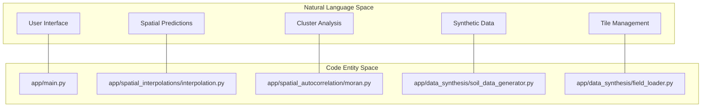
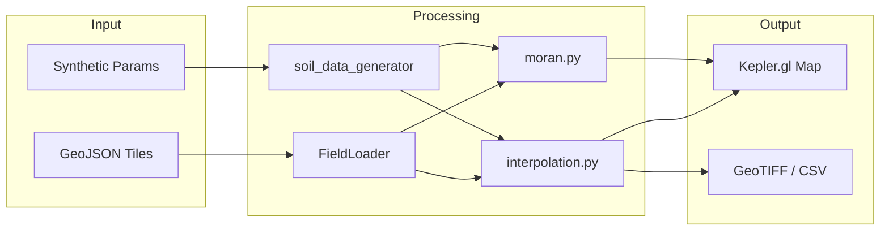

# Spatial Agriculture Toolkit — Overview

The **Spatial Agriculture Toolkit** is a specialized precision agriculture platform designed for the spatial analysis of field-level data. It provides a robust environment for agricultural professionals and researchers to analyze spatial patterns, predict soil fertility events, and identify regional clusters using advanced statistical methods.

The toolkit is built as a hybrid system, leveraging **Python** for the application framework and geospatial processing, and **R** for heavy-lift statistical modeling.

### Core Capabilities

*   **Spatial Interpolation**: Predicts the probability of soil fertility events (e.g., nutrient deficiency, acidification) across a bounded region using strategies like Indicator Kriging and Generalized Additive Models (GAM).
*   **Spatial Autocorrelation**: Detects hotspots, coldspots, and spatial outliers (LISA analysis) to identify areas of significant local similarity or difference.
*   **Synthetic Data Generation**: Simulates agronomic cycle scenarios (e.g., "Degradation by Intensive Use" or "Recovery with Management") to test hypotheses and validate models.
*   **Interactive Visualization**: Uses high-performance Kepler.gl maps integrated into a Streamlit interface for exploring multi-temporal realizations.

Sources: `README.md:1-31`, `README.md:179-191`

---

### High-Level Architecture

The system follows a modular architecture where the Streamlit frontend coordinates data flow between specialized Python modules and an R-based interpolation engine.

#### System Component Bridge
The following diagram illustrates how natural language concepts map to specific code entities within the repository.

**Diagram: Conceptual to Code Mapping**

Sources: `README.md:118-144`

---

### Key Modules

#### 1. Application & UI
The entry point is a Streamlit application `app/main.py:1-10` that manages session state, sidebar navigation, and the integration of Kepler.gl for map rendering. It orchestrates the execution of analysis modules based on user input.
*   For details, see **[Application Architecture](03-application-architecture.md)**.

#### 2. Spatial Interpolation
This module bridges Python and R using `rpy2`. It provides five prediction methods: `linear`, `orthogonal`, `splines`, `GAM`, and `kriging` `app/spatial_interpolations/interpolation.py:122-124`. It generates probability surfaces and exports them as GeoTIFFs or vectorized GeoJSONs.
*   For details, see **[Spatial Interpolation Module](04-spatial-interpolation.md)**.

#### 3. Spatial Autocorrelation
Focuses on Local Indicators of Spatial Association (LISA). It utilizes H3 hexgrids via `geopandas_to_h3` `app/spatial_autocorrelation/geo_utils.py:126-128` to aggregate points and computes Moran's I statistics to classify regions into clusters (HH, LL, HL, LH) `app/spatial_autocorrelation/moran.py:125-127`.
*   For details, see **[Spatial Autocorrelation Module](05-spatial-autocorrelation.md)**.

#### 4. Data Synthesis & Loading
Handles the ingestion of field boundaries and the generation of synthetic soil samples. The `FieldLoader` `app/data_synthesis/field_loader.py:129-131` manages large GeoJSON datasets by loading fragmented tiles, while the `soil_data_generator` `app/data_synthesis/soil_data_generator.py:130-132` simulates temporal changes in soil properties.
*   For details, see **[Data Synthesis Module](06-data-synthesis.md)**.

---

### Navigation & Getting Started

To begin working with the toolkit, follow the structured guides below:

| Section | Description |
| :--- | :--- |
| **[Getting Started](01-getting-started.md)** | Step-by-step guide for Docker setup (`docker compose up`), environment configuration, and running your first analysis. |
| **[Project Structure & Configuration](02-project-structure.md)** | Detailed breakdown of the repository layout, including the `data/`, `output/`, and `app/` directories. |
| **[Glossary](08-glossary.md)** | Definitions of domain-specific terms like "LISA", "H3 Hexgrid", and "Realizations". |

**Diagram: Logical Data Flow**

Sources: `README.md:118-144`, `README.md:146-178`

---

## Table of Contents

- [Getting Started](01-getting-started.md)
- [Project Structure & Configuration](02-project-structure.md)
- [Application Architecture](03-application-architecture.md)
- [Streamlit Frontend (app/main.py)](03.1-streamlit-frontend.md)
- [Containerization & Python/R Integration](03.2-python-r-integration.md)
- [Spatial Interpolation Module](04-spatial-interpolation.md)
- [Interpolation Engine](04.1-interpolation-engine.md)
- [Interpolation Visualization](04.2-interpolation-visualization.md)
- [Spatial Autocorrelation Module](05-spatial-autocorrelation.md)
- [Moran / LISA Engine](05.1-lisa-engine.md)
- [Geospatial Utilities](05.2-geospatial-utilities.md)
- [Autocorrelation Visualization](05.3-autocorrelation-visualization.md)
- [Data Synthesis Module](06-data-synthesis.md)
- [Soil Data Generator](06.2-soil-data-generator.md)
- [Field Loader](06.1-field-loader.md)
- [Tile Fragmentation](06.3-tile-fragmenter.md)
- [Glossary](08-glossary.md)
